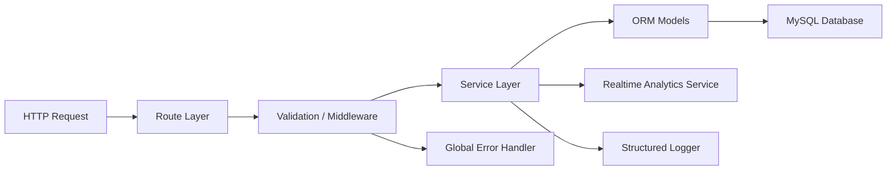
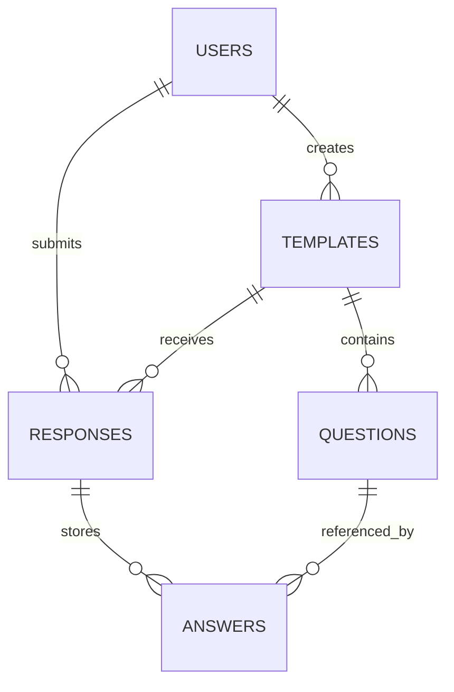

# Formics Backend Defense Guide

## 1. Purpose of the Backend

The backend of Formics is responsible for:

- user registration and authentication;
- role-based authorization;
- template creation and management;
- question storage and validation;
- response submission and answer storage;
- administration of users and roles;
- real-time operational analytics delivery;
- persistence of application state in a relational database.

The backend is not a mock API. It works with a real relational schema and stores data in MySQL for the defended production scenario.

## 2. Technology Stack

Main backend technologies:

- **Node.js** as the server runtime;
- **Express 5** as the server-side framework;
- **Sequelize** as the ORM;
- **MySQL** as the defended OLTP database;
- **SQLite** only as a local development fallback;
- **JWT** for stateless authentication;
- **bcrypt** for password hashing;
- **Pino** for structured logging;
- **Vitest + Supertest** for backend tests.

Why this stack is justified:

- Express is a modern high-level framework suitable for REST APIs;
- Sequelize provides ORM mapping and reduces low-level SQL boilerplate;
- MySQL is appropriate for transactional workloads with clear entity relationships;
- JWT fits SPA authentication well;
- bcrypt is an accepted industry-standard password hashing algorithm.

## 3. Backend Architecture

The backend follows a layered architecture with separation of concerns.



### 3.1 Layers

**Presentation / API layer**

- implemented through Express routes;
- receives HTTP requests and returns JSON responses;
- files: [server/routes/auth.ts](/Users/danila/Projets/Formics/server/routes/auth.ts), [server/routes/templates.ts](/Users/danila/Projets/Formics/server/routes/templates.ts), [server/routes/responses.ts](/Users/danila/Projets/Formics/server/routes/responses.ts), [server/routes/users.ts](/Users/danila/Projets/Formics/server/routes/users.ts), [server/routes/analytics.ts](/Users/danila/Projets/Formics/server/routes/analytics.ts)

**Validation and middleware layer**

- validates input and enforces authentication/authorization;
- files: [server/validators](/Users/danila/Projets/Formics/server/validators), [server/middleware/authenticateJWT.ts](/Users/danila/Projets/Formics/server/middleware/authenticateJWT.ts), [server/middleware/authorize.ts](/Users/danila/Projets/Formics/server/middleware/validateRequest.ts)

**Business logic layer**

- encapsulates business rules and multi-step operations;
- files: [server/services/authService.ts](/Users/danila/Projets/Formics/server/services/authService.ts), [server/services/templateService.ts](/Users/danila/Projets/Formics/server/services/templateService.ts), [server/services/responseService.ts](/Users/danila/Projets/Formics/server/services/responseService.ts), [server/services/accessService.ts](/Users/danila/Projets/Formics/server/services/accessService.ts)

**Data access layer**

- implemented with Sequelize models and associations;
- files: [server/models](/Users/danila/Projets/Formics/server/models), [server/db.ts](/Users/danila/Projets/Formics/server/db.ts)

### 3.2 Why this is modular

The backend is not monolithic:

- routes do not directly contain the full business logic;
- access checks are extracted into dedicated services;
- validation is extracted into validators;
- error handling is centralized;
- logging is centralized;
- ORM and infrastructure are configured separately.

This structure makes the backend easier to maintain, test, and extend.

## 4. Main Domain Entities

The backend operates on the following main entities:

- `User`
- `Template`
- `Question`
- `Response`
- `Answer`

Logical domain model:



This model reflects the real workflow of the application:

1. a user creates a template;
2. the template contains questions;
3. another user submits a response;
4. the response contains answers linked to specific questions.

## 5. Authentication and Authorization

Authentication is implemented with JWT.

Authentication flow:

1. user registers or logs in;
2. backend validates credentials;
3. backend returns a signed JWT;
4. frontend stores the token;
5. protected requests send `Authorization: Bearer <token>`.

Files involved:

- [server/routes/auth.ts](/Users/danila/Projets/Formics/server/routes/auth.ts)
- [server/services/authService.ts](/Users/danila/Projets/Formics/server/services/authService.ts)
- [server/middleware/authenticateJWT.ts](/Users/danila/Projets/Formics/server/middleware/authenticateJWT.ts)

Authorization is role- and ownership-based.

Examples:

- only admins can access user administration routes;
- only template owners or admins can manage template responses;
- public templates can be viewed without exposing private templates;
- answer access is restricted through response ownership and template ownership checks.

This is implemented in:

- [server/services/accessService.ts](/Users/danila/Projets/Formics/server/services/accessService.ts)
- [server/middleware/authorize.ts](/Users/danila/Projets/Formics/server/middleware/authorize.ts)

## 6. Security Measures

The backend includes the following security controls:

- passwords are hashed with `bcrypt`, not stored in plain text;
- JWT is used instead of a custom token mechanism;
- secrets are stored in environment variables, not hardcoded in repository configuration;
- request payloads are validated before service execution;
- protected routes require JWT;
- admin operations require role checks;
- private business data is not returned as static stub data;
- real-time analytics exposes aggregated operational data, not raw sensitive form answers.

Files that demonstrate this:

- [server/package.json](/Users/danila/Projets/Formics/server/package.json)
- [server/validators/authValidators.ts](/Users/danila/Projets/Formics/server/validators/authValidators.ts)
- [server/middleware/authenticateJWT.ts](/Users/danila/Projets/Formics/server/middleware/authenticateJWT.ts)
- [server/utils/serializers.ts](/Users/danila/Projets/Formics/server/utils/serializers.ts)

## 7. Input Validation

Input validation is implemented with `express-validator`.

Validation is used for:

- authentication payloads;
- route parameters;
- template creation and update payloads;
- response payloads;
- question payloads;
- user update payloads.

Main files:

- [server/validators/authValidators.ts](/Users/danila/Projets/Formics/server/validators/authValidators.ts)
- [server/validators/templateValidators.ts](/Users/danila/Projets/Formics/server/validators/templateValidators.ts)
- [server/validators/responseValidators.ts](/Users/danila/Projets/Formics/server/validators/responseValidators.ts)
- [server/validators/questionValidators.ts](/Users/danila/Projets/Formics/server/validators/questionValidators.ts)
- [server/middleware/validateRequest.ts](/Users/danila/Projets/Formics/server/middleware/validateRequest.ts)

This helps prevent malformed data and reduces security risks caused by unvalidated input.

## 8. Error Handling

The backend uses centralized global error handling.

Files:

- [server/middleware/errorHandler.ts](/Users/danila/Projets/Formics/server/middleware/errorHandler.ts)
- [server/errors/AppError.ts](/Users/danila/Projets/Formics/server/errors/AppError.ts)

What it handles:

- application-level errors with explicit HTTP status codes;
- validation errors;
- unknown internal server errors.

Benefits:

- consistent error response format;
- easier debugging;
- cleaner route handlers;
- correct separation between happy-path logic and error-path logic.

Example response format:

```json
{
  "error": "Validation failed",
  "details": []
}
```

## 9. Logging

Logging is implemented with `pino` and `pino-http`.

Files:

- [server/utils/logger.ts](/Users/danila/Projets/Formics/server/utils/logger.ts)
- [server/app.ts](/Users/danila/Projets/Formics/server/app.ts)

What is logged:

- HTTP requests;
- database connection status;
- validation and application errors;
- startup and shutdown events;
- unexpected server failures.

Why this satisfies the requirement:

- logs are structured JSON logs;
- logs go to stdout/stderr and are suitable for cloud analysis;
- important backend events are traceable.

## 10. Database and ORM

The defended production database is MySQL.

Why MySQL is appropriate:

- the project is transactional, not analytical;
- the data model is relational;
- entities have strong parent-child relationships;
- integrity constraints and foreign keys are required.

ORM:

- Sequelize is used for model mapping, associations, and transactions.

Database configuration:

- [server/db.ts](/Users/danila/Projets/Formics/server/db.ts)

Database documentation:

- [DATABASE.md](/Users/danila/Projets/Formics/DATABASE.md)

Versioned SQL scripts:

- [V1__schema.sql](/Users/danila/Projets/Formics/server/database/sql/V1__schema.sql)
- [V2__seed_demo_data.sql](/Users/danila/Projets/Formics/server/database/sql/V2__seed_demo_data.sql)
- [V3__roles.sql](/Users/danila/Projets/Formics/server/database/sql/V3__roles.sql)

For Railway deployment, adapted scripts are also available:

- [railway_schema.sql](/Users/danila/Projets/Formics/server/database/sql/railway_schema.sql)
- [railway_seed.sql](/Users/danila/Projets/Formics/server/database/sql/railway_seed.sql)

## 11. Transactions and Integrity

The backend uses transactions for multi-step business operations.

Examples:

- creating a template together with its questions;
- updating a template and replacing nested questions;
- creating a response together with its answers.

Files:

- [server/services/templateService.ts](/Users/danila/Projets/Formics/server/services/templateService.ts)
- [server/services/responseService.ts](/Users/danila/Projets/Formics/server/services/responseService.ts)

Why this matters:

- the database is protected from partial writes;
- entity consistency is preserved;
- the API does not leave orphaned or half-written records.

## 12. API Design

The backend is a REST-style JSON API.

Examples of routes:

- `POST /api/auth/register`
- `POST /api/auth/login`
- `GET /api/templates`
- `POST /api/templates`
- `PUT /api/templates/:id`
- `POST /api/responses/from-template/:templateId`
- `GET /api/analytics/realtime/snapshot`

API documentation:

- [server/API.md](/Users/danila/Projets/Formics/server/API.md)

The backend does not use fake static JSON responses. It interacts with the database and returns real persisted data.

## 13. Real-Time Backend Component

The project includes a real-time analytics backend module.

Events treated as real-time:

- template creation;
- template update;
- response submission.

Technology:

- SSE (Server-Sent Events)

Main files:

- [server/services/realtimeAnalyticsService.ts](/Users/danila/Projets/Formics/server/services/realtimeAnalyticsService.ts)
- [server/routes/analytics.ts](/Users/danila/Projets/Formics/server/routes/analytics.ts)
- [REALTIME_ANALYTICS.md](/Users/danila/Projets/Formics/REALTIME_ANALYTICS.md)

This is useful on the defense because it shows that the backend is not limited to CRUD operations only.

## 14. Tests and Coverage

Backend tests are implemented with Vitest and Supertest.

Files:

- [server/test/services.test.ts](/Users/danila/Projets/Formics/server/test/services.test.ts)
- [server/test/realtimeAnalyticsService.test.ts](/Users/danila/Projets/Formics/server/test/realtimeAnalyticsService.test.ts)
- [server/vitest.config.ts](/Users/danila/Projets/Formics/server/vitest.config.ts)

Current verified test result:

- `3` test files passed;
- `29` tests passed;
- coverage:
  - `89.33%` lines
  - `90.38%` functions
  - `88.75%` statements

This exceeds the minimum 70% requirement for business logic coverage.

## 15. CI and Automated Checks

Automated backend validation is configured in GitHub Actions.

File:

- [server-ci.yml](/Users/danila/Projets/Formics/.github/workflows/server-ci.yml)

The pipeline runs:

- `npm ci`
- `npm run typecheck`
- `npm test`
- `npm run build`

This supports the requirement that the backend should be reproducible and automatically checked from the repository.

## 16. Production Deployment

The backend is deployed in a production-accessible environment.

Current defended deployment path:

- backend: Railway
- database: Railway MySQL

Deployment artifacts:

- [server/Dockerfile](/Users/danila/Projets/Formics/server/Dockerfile)
- [server/DEPLOYMENT.md](/Users/danila/Projets/Formics/server/DEPLOYMENT.md)
- [README.md](/Users/danila/Projets/Formics/README.md)

Important deployment characteristics:

- Dockerized backend image;
- environment-based configuration;
- cloud-accessible public URL;
- external MySQL database;
- structured logs to stdout;
- health endpoint at `/health`.

This satisfies the production deployment requirement for passing grade.

## 17. Compliance with Minimum Requirements

| Requirement | Status | Evidence |
|---|---|---|
| Modern framework | Met | Express backend in [server/app.ts](/Users/danila/Projets/Formics/server/app.ts) |
| Database used for state | Met | MySQL/SQLite config in [server/db.ts](/Users/danila/Projets/Formics/server/db.ts) |
| ORM | Met | Sequelize in [server/package.json](/Users/danila/Projets/Formics/server/package.json) |
| Layered architecture | Met | routes/services/middleware/validators/models structure |
| SOLID-oriented modularity | Reasonably met | separated responsibilities and extracted services |
| API description | Met | [server/API.md](/Users/danila/Projets/Formics/server/API.md) |
| Global error handling | Met | [server/middleware/errorHandler.ts](/Users/danila/Projets/Formics/server/middleware/errorHandler.ts) |
| Structured logging | Met | [server/utils/logger.ts](/Users/danila/Projets/Formics/server/utils/logger.ts) |
| Production deployment | Met | Railway deployment + Docker image |
| Unit tests and coverage >= 70% | Met | `89.33%` lines coverage |
| Secrets not stored in repo code | Met | env-based configuration |
| JSON as main format | Met | REST JSON API |
| Real API, not stubs | Met | DB-backed routes and services |
| Version control and automation | Met | Git + [server-ci.yml](/Users/danila/Projets/Formics/.github/workflows/server-ci.yml) |

## 18. Honest Limitations

This backend satisfies the minimum passing-grade requirements, but it is not designed as a maximum-score enterprise system.

Current non-goals:

- no microservice architecture;
- no queue broker such as RabbitMQ or Kafka;
- no Redis caching layer;
- no Prometheus/Grafana monitoring stack;
- no centralized external ELK/Loki logging platform;
- no alerting system;
- no advanced tracing between microservices, because the application is monolithic.

These are acceptable limitations for a defended minimum-to-good diploma backend, but they should not be presented as implemented features.

## 19. What to Say During the Defense

Short explanation:

> The backend is implemented as a modular Express application with Sequelize ORM and MySQL as the main transactional database. It separates API routes, validation, middleware, business services, and persistence models. Authentication is based on JWT, passwords are hashed with bcrypt, errors are handled centrally, logs are structured, and business logic is covered by tests with coverage above 70%. The backend is containerized and deployed in a production-accessible environment.

## 20. Suggested Live Demo Order

Recommended backend-oriented demo:

1. open the deployed backend `/health` endpoint;
2. show API documentation in [server/API.md](/Users/danila/Projets/Formics/server/API.md);
3. show the backend folder structure;
4. show one route, one validator, and one service to demonstrate layering;
5. show [server/middleware/errorHandler.ts](/Users/danila/Projets/Formics/server/middleware/errorHandler.ts) for global error handling;
6. show [server/utils/logger.ts](/Users/danila/Projets/Formics/server/utils/logger.ts) for structured logging;
7. show [server/vitest.config.ts](/Users/danila/Projets/Formics/server/vitest.config.ts) and current coverage result;
8. show Railway deployment and public backend URL;
9. show the real MySQL database with actual tables and demo data;
10. if needed, show SSE analytics endpoint as an additional advanced backend capability.

## 21. Likely Questions and Good Answers

**Why Express?**

Express is a modern high-level backend framework for Node.js. It is lightweight, flexible, and fits well for a REST API with middleware, validation, authentication, and modular route composition.

**Why MySQL and not MongoDB?**

Because the domain model is relational and transactional. The system has clear entities and parent-child relationships: users, templates, questions, responses, and answers. Referential integrity matters here.

**Why Sequelize?**

It provides ORM mapping, model associations, and transactions, which reduces repetitive SQL code and makes the data layer more maintainable.

**How do you ensure security?**

Passwords are hashed with bcrypt, routes are protected with JWT, role-based access checks are implemented, input validation is applied, and secrets are kept in environment variables.

**How do you ensure reliability?**

The backend uses centralized error handling, validation, transactions for multi-step writes, and automated tests with coverage above the required threshold.

**How do you prove it is not a mock backend?**

The backend works with a real MySQL database, uses Sequelize models, persists real entities, and can be demonstrated with existing tables, users, templates, responses, and answers.
