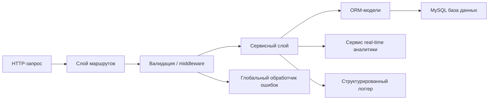
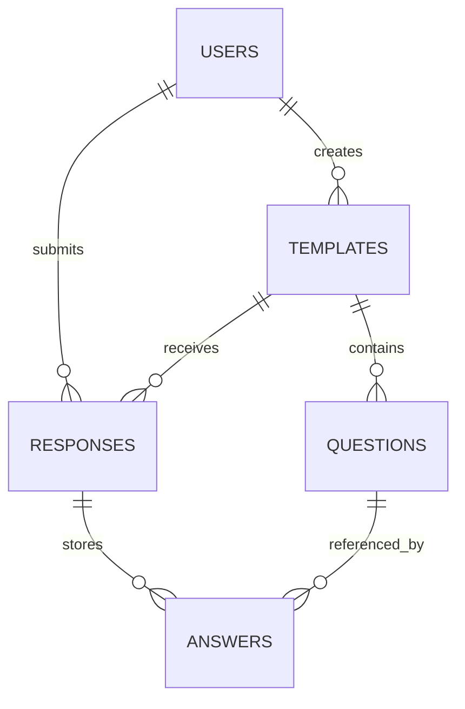

# Formics: руководство для защиты backend-части

## 1. Назначение backend-части

Backend приложения Formics отвечает за:

- регистрацию и аутентификацию пользователей;
- авторизацию на основе ролей и прав доступа;
- создание и управление шаблонами форм;
- хранение вопросов и проверку их структуры;
- отправку ответов и сохранение заполненных форм;
- административное управление пользователями;
- выдачу real-time аналитики по событиям системы;
- сохранение состояния приложения в реляционной базе данных.

Backend не является заглушкой или учебным mock API. Он работает с реальной реляционной схемой данных и в защищаемом сценарии использует MySQL.

## 2. Технологический стек

Основные backend-технологии:

- **Node.js** как серверная среда выполнения;
- **Express 5** как серверный фреймворк;
- **Sequelize** как ORM;
- **MySQL** как основная OLTP-база данных для защиты;
- **SQLite** только как локальный dev fallback;
- **JWT** для stateless-аутентификации;
- **bcrypt** для хеширования паролей;
- **Pino** для structured logging;
- **Vitest + Supertest** для тестирования backend-логики.

Почему этот стек обоснован:

- Express является современным высокоуровневым backend-фреймворком;
- Sequelize дает ORM-слой и избавляет от избыточного низкоуровневого SQL-кода;
- MySQL подходит для транзакционной реляционной предметной области;
- JWT хорошо сочетается со SPA-клиентом;
- bcrypt является стандартным и безопасным алгоритмом хранения паролей.

## 3. Архитектура backend

Backend построен по слоистой архитектуре с разделением ответственности.



### 3.1 Слои

**Слой представления / API**

- реализован через Express routes;
- принимает HTTP-запросы и отдает JSON-ответы;
- файлы: [server/routes/auth.ts](/Users/danila/Projets/Formics/server/routes/auth.ts), [server/routes/templates.ts](/Users/danila/Projets/Formics/server/routes/templates.ts), [server/routes/responses.ts](/Users/danila/Projets/Formics/server/routes/responses.ts), [server/routes/users.ts](/Users/danila/Projets/Formics/server/routes/users.ts), [server/routes/analytics.ts](/Users/danila/Projets/Formics/server/routes/analytics.ts)

**Слой валидации и middleware**

- валидирует входные данные и применяет правила доступа;
- файлы: [server/validators](/Users/danila/Projets/Formics/server/validators), [server/middleware/authenticateJWT.ts](/Users/danila/Projets/Formics/server/middleware/authenticateJWT.ts), [server/middleware/authorize.ts](/Users/danila/Projets/Formics/server/middleware/authorize.ts), [server/middleware/validateRequest.ts](/Users/danila/Projets/Formics/server/middleware/validateRequest.ts)

**Слой бизнес-логики**

- инкапсулирует правила работы системы и многошаговые операции;
- файлы: [server/services/authService.ts](/Users/danila/Projets/Formics/server/services/authService.ts), [server/services/templateService.ts](/Users/danila/Projets/Formics/server/services/templateService.ts), [server/services/responseService.ts](/Users/danila/Projets/Formics/server/services/responseService.ts), [server/services/accessService.ts](/Users/danila/Projets/Formics/server/services/accessService.ts)

**Слой доступа к данным**

- реализован через Sequelize models и associations;
- файлы: [server/models](/Users/danila/Projets/Formics/server/models), [server/db.ts](/Users/danila/Projets/Formics/server/db.ts)

### 3.2 Почему архитектура считается модульной

Backend не является монолитом в одном файле:

- маршруты не содержат всю бизнес-логику напрямую;
- проверки доступа вынесены в отдельный сервис;
- валидация вынесена в validators;
- обработка ошибок централизована;
- логирование централизовано;
- конфигурация БД и инфраструктуры вынесена отдельно.

Это делает backend проще для сопровождения, тестирования и дальнейшего развития.

## 4. Основные сущности предметной области

Backend работает со следующими сущностями:

- `User`
- `Template`
- `Question`
- `Response`
- `Answer`

Логическая доменная модель:



Эта модель отражает реальный сценарий работы системы:

1. пользователь создает шаблон формы;
2. шаблон содержит набор вопросов;
3. другой пользователь отправляет заполненную форму;
4. система сохраняет response и связанные answers.

## 5. Аутентификация и авторизация

Аутентификация реализована через JWT.

Сценарий работы:

1. пользователь регистрируется или входит в систему;
2. backend проверяет учетные данные;
3. backend выдает подписанный JWT;
4. frontend сохраняет токен;
5. защищенные запросы отправляются с `Authorization: Bearer <token>`.

Основные файлы:

- [server/routes/auth.ts](/Users/danila/Projets/Formics/server/routes/auth.ts)
- [server/services/authService.ts](/Users/danila/Projets/Formics/server/services/authService.ts)
- [server/middleware/authenticateJWT.ts](/Users/danila/Projets/Formics/server/middleware/authenticateJWT.ts)

Авторизация реализована на основе ролей и владения сущностями.

Примеры:

- только администратор может управлять пользователями;
- только владелец шаблона или администратор может просматривать ответы по шаблону;
- публичные шаблоны можно открывать без доступа к приватным шаблонам;
- доступ к answers ограничивается через доступ к response и template.

Это реализовано в:

- [server/services/accessService.ts](/Users/danila/Projets/Formics/server/services/accessService.ts)
- [server/middleware/authorize.ts](/Users/danila/Projets/Formics/server/middleware/authorize.ts)

## 6. Меры безопасности

В backend реализованы следующие меры безопасности:

- пароли хранятся как `bcrypt` hash, а не в открытом виде;
- используется стандартный JWT, а не самописный механизм токенов;
- секреты вынесены в environment variables;
- входные данные валидируются до выполнения бизнес-логики;
- защищенные маршруты требуют JWT;
- административные операции требуют role check;
- backend не отдает статические fake-ответы вместо реальной работы с БД;
- real-time аналитика отдает агрегированные operational data, а не сырые пользовательские ответы.

Это подтверждается в:

- [server/package.json](/Users/danila/Projets/Formics/server/package.json)
- [server/validators/authValidators.ts](/Users/danila/Projets/Formics/server/validators/authValidators.ts)
- [server/middleware/authenticateJWT.ts](/Users/danila/Projets/Formics/server/middleware/authenticateJWT.ts)
- [server/utils/serializers.ts](/Users/danila/Projets/Formics/server/utils/serializers.ts)

## 7. Валидация входных данных

Валидация реализована через `express-validator`.

Она применяется для:

- payload при регистрации и логине;
- route parameters;
- создания и изменения шаблонов;
- отправки response;
- создания и изменения вопросов;
- обновления данных пользователя.

Основные файлы:

- [server/validators/authValidators.ts](/Users/danila/Projets/Formics/server/validators/authValidators.ts)
- [server/validators/templateValidators.ts](/Users/danila/Projets/Formics/server/validators/templateValidators.ts)
- [server/validators/responseValidators.ts](/Users/danila/Projets/Formics/server/validators/responseValidators.ts)
- [server/validators/questionValidators.ts](/Users/danila/Projets/Formics/server/validators/questionValidators.ts)
- [server/middleware/validateRequest.ts](/Users/danila/Projets/Formics/server/middleware/validateRequest.ts)

Это снижает риск ошибок и уязвимостей из-за невалидного ввода.

## 8. Обработка ошибок

В backend реализован централизованный global error handling.

Файлы:

- [server/middleware/errorHandler.ts](/Users/danila/Projets/Formics/server/middleware/errorHandler.ts)
- [server/errors/AppError.ts](/Users/danila/Projets/Formics/server/errors/AppError.ts)

Что он покрывает:

- прикладные ошибки с явным HTTP status code;
- ошибки валидации;
- неизвестные внутренние ошибки сервера.

Преимущества:

- единый формат ошибок;
- более простая отладка;
- чище маршруты;
- разделение между happy-path и error-path логикой.

Пример формата ответа:

```json
{
  "error": "Validation failed",
  "details": []
}
```

## 9. Логирование

Логирование реализовано через `pino` и `pino-http`.

Файлы:

- [server/utils/logger.ts](/Users/danila/Projets/Formics/server/utils/logger.ts)
- [server/app.ts](/Users/danila/Projets/Formics/server/app.ts)

Что логируется:

- HTTP-запросы;
- статус подключения к базе данных;
- ошибки валидации и прикладные ошибки;
- события запуска и остановки;
- неожиданные внутренние ошибки сервера.

Почему это удовлетворяет требованию:

- логи имеют structured JSON формат;
- они пишутся в stdout/stderr и подходят для облачной среды;
- ключевые события backend можно анализировать.

## 10. База данных и ORM

Основная защищаемая база данных — MySQL.

Почему выбран именно MySQL:

- система является транзакционной, а не аналитической;
- предметная область реляционная;
- между сущностями есть явные parent-child связи;
- необходимы foreign keys, ограничения и контроль целостности.

ORM:

- используется Sequelize для model mapping, associations и transactions.

Конфигурация БД:

- [server/db.ts](/Users/danila/Projets/Formics/server/db.ts)

Документация по БД:

- [DATABASE.md](/Users/danila/Projets/Formics/DATABASE.md)

Versioned SQL scripts:

- [V1__schema.sql](/Users/danila/Projets/Formics/server/database/sql/V1__schema.sql)
- [V2__seed_demo_data.sql](/Users/danila/Projets/Formics/server/database/sql/V2__seed_demo_data.sql)
- [V3__roles.sql](/Users/danila/Projets/Formics/server/database/sql/V3__roles.sql)

Для Railway есть адаптированные скрипты:

- [railway_schema.sql](/Users/danila/Projets/Formics/server/database/sql/railway_schema.sql)
- [railway_seed.sql](/Users/danila/Projets/Formics/server/database/sql/railway_seed.sql)

## 11. Транзакции и целостность данных

Backend использует транзакции для многошаговых операций.

Примеры:

- создание шаблона вместе с вопросами;
- обновление шаблона и замена вложенных вопросов;
- создание response вместе со всеми answers.

Файлы:

- [server/services/templateService.ts](/Users/danila/Projets/Formics/server/services/templateService.ts)
- [server/services/responseService.ts](/Users/danila/Projets/Formics/server/services/responseService.ts)

Почему это важно:

- база защищена от partial writes;
- сохраняется целостность сущностей;
- API не оставляет orphaned и partially-written записей.

## 12. Проектирование API

Backend реализован как REST-style JSON API.

Примеры маршрутов:

- `POST /api/auth/register`
- `POST /api/auth/login`
- `GET /api/templates`
- `POST /api/templates`
- `PUT /api/templates/:id`
- `POST /api/responses/from-template/:templateId`
- `GET /api/analytics/realtime/snapshot`

Документация API:

- [server/API.md](/Users/danila/Projets/Formics/server/API.md)

Backend не использует fake JSON вместо реальной логики. Все маршруты работают с настоящей БД и реальными сущностями.

## 13. Real-time backend-компонент

В проекте есть отдельный real-time analytics модуль.

События, обрабатываемые в near real-time:

- создание шаблона;
- обновление шаблона;
- отправка ответа на форму.

Технология:

- SSE (Server-Sent Events)

Основные файлы:

- [server/services/realtimeAnalyticsService.ts](/Users/danila/Projets/Formics/server/services/realtimeAnalyticsService.ts)
- [server/routes/analytics.ts](/Users/danila/Projets/Formics/server/routes/analytics.ts)
- [REALTIME_ANALYTICS.md](/Users/danila/Projets/Formics/REALTIME_ANALYTICS.md)

Это усиливает защиту, потому что backend демонстрирует не только CRUD, но и обработку событий в реальном времени.

## 14. Тесты и покрытие

Тестирование backend выполнено на Vitest и Supertest.

Файлы:

- [server/test/services.test.ts](/Users/danila/Projets/Formics/server/test/services.test.ts)
- [server/test/realtimeAnalyticsService.test.ts](/Users/danila/Projets/Formics/server/test/realtimeAnalyticsService.test.ts)
- [server/vitest.config.ts](/Users/danila/Projets/Formics/server/vitest.config.ts)

Текущий подтвержденный результат:

- `3` test files passed;
- `29` tests passed;
- coverage:
  - `89.33%` lines
  - `90.38%` functions
  - `88.75%` statements

Это выше минимального требования `70%`.

## 15. CI и автоматические проверки

Автоматическая backend-проверка настроена через GitHub Actions.

Файл:

- [server-ci.yml](/Users/danila/Projets/Formics/.github/workflows/server-ci.yml)

Pipeline запускает:

- `npm ci`
- `npm run typecheck`
- `npm test`
- `npm run build`

Это подтверждает воспроизводимость и автоматическую проверяемость backend из репозитория.

## 16. Production deployment

Backend развернут в production-доступной среде.

Текущий защищаемый сценарий:

- backend: Railway
- database: Railway MySQL

Артефакты деплоя:

- [server/Dockerfile](/Users/danila/Projets/Formics/server/Dockerfile)
- [server/DEPLOYMENT.md](/Users/danila/Projets/Formics/server/DEPLOYMENT.md)
- [README.md](/Users/danila/Projets/Formics/README.md)

Ключевые характеристики деплоя:

- Dockerized backend image;
- конфигурация через environment variables;
- публично доступный cloud URL;
- внешняя MySQL база данных;
- structured logging в stdout;
- health endpoint `/health`.

Это закрывает минимальное требование по production deployment.

## 17. Соответствие минимальным требованиям

| Требование | Статус | Доказательство |
|---|---|---|
| Современный framework | Выполнено | Express в [server/app.ts](/Users/danila/Projets/Formics/server/app.ts) |
| Использование базы данных | Выполнено | MySQL/SQLite конфигурация в [server/db.ts](/Users/danila/Projets/Formics/server/db.ts) |
| ORM | Выполнено | Sequelize в [server/package.json](/Users/danila/Projets/Formics/server/package.json) |
| Layered architecture | Выполнено | структура routes/services/middleware/validators/models |
| SOLID-ориентированная модульность | В целом выполнено | ответственности разделены по слоям |
| API documentation | Выполнено | [server/API.md](/Users/danila/Projets/Formics/server/API.md) |
| Global error handling | Выполнено | [server/middleware/errorHandler.ts](/Users/danila/Projets/Formics/server/middleware/errorHandler.ts) |
| Structured logging | Выполнено | [server/utils/logger.ts](/Users/danila/Projets/Formics/server/utils/logger.ts) |
| Production deployment | Выполнено | Railway deployment + Docker |
| Unit tests и coverage >= 70% | Выполнено | `89.33%` lines coverage |
| Secrets не хранятся в коде | Выполнено | env-based configuration |
| JSON как основной формат | Выполнено | REST JSON API |
| Реальный API, а не stubs | Выполнено | маршруты и сервисы работают с БД |
| Version control и automation | Выполнено | Git + [server-ci.yml](/Users/danila/Projets/Formics/.github/workflows/server-ci.yml) |

## 18. Честные ограничения проекта

Этот backend соответствует минимальным требованиям для защиты, но не является enterprise-решением на максимальный балл.

Что не реализовано:

- microservice architecture;
- message broker вроде RabbitMQ или Kafka;
- Redis caching layer;
- Prometheus/Grafana monitoring stack;
- централизованный внешний ELK/Loki logging stack;
- alerting system;
- distributed tracing между микросервисами, потому что приложение монолитное.

Это допустимые ограничения для дипломного backend-проекта на проходной и хороший уровень, но их не нужно выдавать за реализованные функции.

## 19. Что говорить на защите

Короткая формулировка:

> Backend проекта реализован как модульное Express-приложение с Sequelize ORM и MySQL как основной транзакционной базой данных. В нем разделены маршруты, валидация, middleware, сервисный слой и модели. Аутентификация реализована через JWT, пароли хранятся в виде bcrypt hash, ошибки обрабатываются централизованно, логирование структурировано, а бизнес-логика покрыта тестами с покрытием выше 70%. Backend контейнеризирован и развернут в production-доступной среде.

## 20. Рекомендуемый порядок live demo

Для показа backend-части удобно идти так:

1. открыть deployed backend endpoint `/health`;
2. показать API documentation в [server/API.md](/Users/danila/Projets/Formics/server/API.md);
3. показать структуру backend-папки;
4. показать один route, один validator и один service как пример layered architecture;
5. показать [server/middleware/errorHandler.ts](/Users/danila/Projets/Formics/server/middleware/errorHandler.ts) как global error handling;
6. показать [server/utils/logger.ts](/Users/danila/Projets/Formics/server/utils/logger.ts) как structured logging;
7. показать [server/vitest.config.ts](/Users/danila/Projets/Formics/server/vitest.config.ts) и текущее покрытие;
8. показать Railway deployment и публичный backend URL;
9. показать реальную MySQL базу с таблицами и demo data;
10. при необходимости показать SSE analytics endpoint как дополнительную backend-возможность.

## 21. Вероятные вопросы комиссии и хорошие ответы

**Почему выбран Express?**

Express — это современный высокоуровневый backend-framework для Node.js. Он хорошо подходит для REST API с middleware, валидацией, аутентификацией и модульной маршрутизацией.

**Почему MySQL, а не MongoDB?**

Потому что предметная область реляционная и транзакционная. В системе есть четкие сущности и связи: users, templates, questions, responses, answers. Здесь важна referential integrity.

**Почему Sequelize?**

Он дает ORM-слой, associations и transactions, за счет чего код data layer становится проще, чище и удобнее для поддержки.

**Как обеспечивается безопасность?**

Пароли хранятся как bcrypt hash, защищенные маршруты работают через JWT, есть role-based access checks, входные данные валидируются, а секреты вынесены в environment variables.

**Как обеспечивается надежность?**

Backend использует централизованную обработку ошибок, валидацию, транзакции для многошаговых операций и автоматические тесты с покрытием выше требуемого минимума.

**Как доказать, что это не mock backend?**

Backend работает с реальной MySQL базой через Sequelize, сохраняет реальные сущности и может быть продемонстрирован на существующих таблицах, пользователях, шаблонах, ответах и analytics-событиях.
