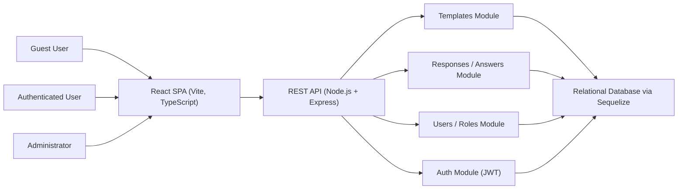

# Business Analysis for Diploma Project

## Project

**Project title:** Formics: Web Platform for Creating, Managing, and Filling Dynamic Forms

**Project type:** client-server web application

**Current document purpose:** prepare the Business Analysis stage for diploma defense and provide a shared understanding of the product vision, scope, stakeholders, solution approach, requirements, and risks.

## 1. Introduction

### 1.1 Purpose of the Document

This document defines the business context and high-level requirements for the Formics diploma project. It is intended to:

- align expectations between the student, supervisor, and defense committee;
- justify the business value of the selected topic;
- define project boundaries and prevent scope creep;
- describe the proposed solution at a level sufficient for the BA defense;
- provide a structured base for later design, implementation, and pre-defense preparation.

### 1.2 Audience

This document is written for:

- diploma defense committee members;
- academic supervisor / reviewer;
- the student as project author;
- potential future developers or evaluators of the system;
- a notional product owner or business stakeholder interested in form lifecycle automation.

## 2. Vision

### 2.1 Vision Statement

Formics is a web platform that allows users to create, publish, manage, and fill dynamic forms through a simple browser-based interface, reducing the effort required to collect structured data and making form lifecycle management accessible for both administrators and regular users.

### 2.2 Problem Statement

Organizations, student teams, internal communities, and small digital products often need to collect structured information from users. In many cases, the available process is fragmented:

- forms are created manually or in inflexible tools;
- access to forms is poorly controlled;
- completed responses are difficult to review and manage;
- there is no single workflow from template creation to answer storage;
- administration of users and roles is handled outside the product.

As a result, data collection becomes slow, inconsistent, and hard to maintain. A dedicated platform is needed to centralize form creation, publication, filling, response storage, and access management in one system.

### 2.3 Business Goals and Objectives

The project aims to achieve the following goals:

- provide a unified workflow for the full lifecycle of dynamic forms;
- reduce manual effort required to create and distribute questionnaires/templates;
- enable controlled access to private and public forms;
- simplify response collection and review for template owners;
- provide administrative tools for user and role management.

Project objectives:

- allow authenticated users to create templates with multiple dynamic question types;
- allow users to publish templates as public or private;
- allow authenticated users to fill forms and save responses;
- allow template owners or authorized users to review submitted results;
- allow administrators to manage user roles and accounts;
- support multilingual UI for a wider audience.

### 2.4 Stakeholder Analysis

| Stakeholder | Interest | Influence |
|---|---|---|
| Student / project author | High | High |
| Diploma committee | High | High |
| Academic supervisor | High | High |
| End users | High | Medium |
| Template owners | High | Medium |
| Administrators | Medium | High |
| Guests / public visitors | Medium | Low |
| Hosting / infrastructure environment | Medium | Medium |

Stakeholder details:

- **Student / project author**: analyst, designer, and developer responsible for implementation and successful diploma delivery.
- **Diploma committee**: evaluates the BA stage and the final project; expects clear justification, realistic scope, and coherent requirements.
- **Academic supervisor**: reviews project direction and quality; expects feasibility and academic rigor.
- **End users (registered users)**: create and fill forms; expect usable interface, reliable saving, and access control.
- **Template owners**: create and manage templates and review submissions; expect flexible template setup and clear response handling.
- **Administrators**: manage users and roles; expect visibility into users and simple administrative operations.
- **Guests / public visitors**: browse public templates; expect easy access to public content.
- **Hosting / infrastructure environment**: runtime platform supporting stable deployment and manageable resource usage.

#### Influence / Interest Matrix

- High influence, high interest: student, committee, supervisor
- High influence, medium interest: administrators
- Medium influence, high interest: template owners, authenticated users
- Low influence, medium interest: guests

### 2.5 Success Criteria

The BA stage and product outcome will be considered successful if the following criteria are met:

- at least one complete form lifecycle is implemented: create template -> publish -> fill -> store responses -> review results;
- role-based access is enforced for protected operations;
- public and private template visibility works as designed;
- administrators can view users, change roles, and delete users;
- average API response time for standard CRUD operations remains acceptable for a diploma-scale system (target: under 1 second in local/demo environment for normal data volumes);
- the system supports at least basic multilingual UI switching;
- the project scope remains stable and aligned with the approved diploma topic.

## 3. Scope

### 3.1 In-Scope

The project includes:

- user registration and login;
- JWT-based authentication and protected routes;
- user profile viewing and editing;
- template creation, editing, deletion, and listing;
- support for dynamic question definitions inside templates;
- public/private template visibility;
- browsing public templates;
- form filling based on a selected template;
- storing responses and answers in a relational database;
- viewing form submissions and answers;
- editing previously submitted answers where allowed by the current implementation;
- administrator panel for viewing users, changing roles, and deleting users;
- client-server architecture with SPA frontend and REST API backend;
- persistent storage through Sequelize ORM and relational database;
- multilingual frontend support.

### 3.2 Out-of-Scope

The following items are intentionally excluded:

- advanced analytics dashboards and BI reporting;
- external integrations with Google Forms, Microsoft Forms, CRM, LMS, or ERP systems;
- email notifications and reminder campaigns;
- workflow automation / approval pipelines for submissions;
- no-code conditional logic builder for complex branching;
- real-time collaboration on template editing;
- file attachments in form answers;
- payment processing;
- mobile native applications;
- enterprise-grade audit logging and SIEM integration;
- SSO / OAuth with third-party identity providers;
- offline mode.

### 3.3 Assumptions

The project is based on the following assumptions:

- users have stable browser and internet access;
- the backend API and database are available during system use;
- the number of concurrent users is moderate and typical for a diploma prototype;
- question types implemented in the current version are sufficient to demonstrate dynamic forms;
- only authenticated users may submit and manage protected data;
- the demo environment will use valid environment variables, including JWT secret and database configuration.

### 3.4 Constraints

Key project constraints:

- limited time frame typical for diploma preparation;
- single primary developer;
- limited budget and infrastructure resources;
- prototype-level operational environment;
- current architecture is based on React + TypeScript on the client and Node.js + Express + Sequelize on the server;
- compliance and security controls are implemented to an academic prototype level, not full enterprise certification level.

## 4. High-Level Solution Overview

### 4.1 Proposed Solution

The proposed solution is a browser-based web platform with a React SPA frontend and a Node.js/Express backend exposing REST endpoints. Authenticated users can create template definitions that contain metadata and a set of questions. Other users can fill these templates, and their answers are stored as structured responses linked to templates and users. Administrators can manage users and roles through a dedicated panel.

### 4.2 Architecture / Integration Landscape

Architecture notes:

- frontend is a single-page application;
- backend is a centralized API layer;
- persistence is implemented through relational entities: users, templates, questions, responses, answers;
- access control is enforced through authentication middleware and authorization checks;
- public templates are exposed through separate public API routes.

### 4.3 Alternatives Considered

#### Option 1: Use an existing SaaS forms platform

Pros:

- fast setup;
- lower development effort.

Cons:

- does not satisfy diploma engineering depth;
- limited control over architecture and data model;
- weak academic value for demonstrating full-stack design.

#### Option 2: Monolithic server-rendered application

Pros:

- simpler deployment;
- fewer moving parts.

Cons:

- less suitable for demonstrating SPA architecture skills;
- lower flexibility for interactive form-building UX.

#### Option 3: Selected solution, SPA + REST API + relational DB

Pros:

- clear separation of concerns;
- demonstrates modern full-stack engineering;
- supports incremental feature growth;
- aligns with the actual implemented repository.

Chosen because it balances academic complexity, real product relevance, and implementation feasibility.

## 5. Features and Requirements

### 5.1 Core Features / Epics

| Epic ID | Epic | Description | Priority |
|---|---|---|---|
| E1 | Authentication and Access Control | Registration, login, protected access, role-based control | Must |
| E2 | User Profile Management | View and edit own profile | Should |
| E3 | Template Management | Create, edit, delete, list form templates | Must |
| E4 | Dynamic Question Management | Define question set and field types inside templates | Must |
| E5 | Public Template Publishing | Mark templates public/private and expose public catalog | Must |
| E6 | Form Filling and Submission | Fill templates and submit responses | Must |
| E7 | Response Review | View stored submissions and answer details | Must |
| E8 | Administration Panel | View users, update roles, delete users | Should |
| E9 | Localization | Support multilingual interface | Could |

### 5.2 Functional Requirements - Work Breakdown

#### Epic E1. Authentication and Access Control

- FR-1.1 The system shall allow a user to register with username, email, and password.
- FR-1.2 The system shall validate required registration fields.
- FR-1.3 The system shall allow a user to log in with email and password.
- FR-1.4 The system shall issue a JWT token after successful authentication.
- FR-1.5 The system shall protect authenticated routes and APIs.
- FR-1.6 The system shall restrict administrative functions to admin users.

#### Epic E2. User Profile Management

- FR-2.1 The system shall allow an authenticated user to view their profile data.
- FR-2.2 The system shall allow an authenticated user to edit username and email.

#### Epic E3. Template Management

- FR-3.1 The system shall allow an authenticated user to create a template.
- FR-3.2 The system shall allow a template owner to edit a template.
- FR-3.3 The system shall allow a template owner to delete a template.
- FR-3.4 The system shall allow a user to view their templates.
- FR-3.5 The system shall allow an administrator to view all templates.

#### Epic E4. Dynamic Question Management

- FR-4.1 The system shall allow the creator to add multiple questions to a template.
- FR-4.2 The system shall allow the creator to define title, description, and field type for each question.
- FR-4.3 The system shall support at least the following field types: text, textarea, number, checkbox.
- FR-4.4 The system shall store questions as part of template structure.

#### Epic E5. Public Template Publishing

- FR-5.1 The system shall allow a template to be marked as public or private.
- FR-5.2 The system shall expose a public list of templates marked as public.
- FR-5.3 Guests or non-authenticated visitors may browse public templates, subject to current UI limitations.

#### Epic E6. Form Filling and Submission

- FR-6.1 The system shall display all questions for a selected template.
- FR-6.2 The system shall collect answers according to question type.
- FR-6.3 The system shall create a response linked to the selected template and current user.
- FR-6.4 The system shall store each answer linked to both response and question.

#### Epic E7. Response Review

- FR-7.1 The system shall allow a user to view their submitted responses.
- FR-7.2 The system shall allow viewing answers for a specific response.
- FR-7.3 The system shall allow listing responses for a template.
- FR-7.4 The system shall allow authorized users to edit or delete responses/answers where supported.

#### Epic E8. Administration Panel

- FR-8.1 The system shall allow an admin to view the list of users.
- FR-8.2 The system shall allow an admin to change a user role.
- FR-8.3 The system shall allow an admin to delete a user.

#### Epic E9. Localization

- FR-9.1 The system shall support multilingual text resources.
- FR-9.2 The system shall allow interface translation at least for English, Russian, and Polish, based on the current codebase.

### 5.3 User Stories

Below are representative user stories with full descriptions.

#### US-1 Register in the platform

**User Story:** As a new user, I want to register an account, so that I can create and fill forms in the system.

**Context:** Access to protected features requires authentication.

**Scope / desired result:**

- enter username, email, and password;
- validate input;
- create a new user account.

**Acceptance Criteria:**

- valid data creates a user successfully;
- duplicate email is rejected;
- password shorter than minimum length is rejected.

**Assumptions:** user provides a unique email.

**Risks / Dependencies:** depends on database availability and secure password hashing.

**Mockups / Attachments:** authentication page.

**Priority:** Must

#### US-2 Log in to access protected features

**User Story:** As a registered user, I want to log in, so that I can access my templates and responses.

**Context:** Protected routes require a valid JWT token.

**Scope / desired result:**

- authenticate with email and password;
- receive a token on success;
- open protected pages.

**Acceptance Criteria:**

- valid credentials return a token;
- invalid password returns an authorization error;
- non-existing user returns not found.

**Assumptions:** JWT secret is configured in runtime environment.

**Risks / Dependencies:** depends on auth service and token storage in the client.

**Mockups / Attachments:** login form.

**Priority:** Must

#### US-3 Create a form template

**User Story:** As an authenticated user, I want to create a template with metadata and questions, so that others can fill my form.

**Context:** Template creation is the starting point of the form lifecycle.

**Scope / desired result:**

- enter title, description, topic, tags;
- mark template public/private;
- add multiple questions.

**Acceptance Criteria:**

- template is saved in the database;
- questions are created and linked to the template;
- creator becomes owner of the template.

**Assumptions:** user is authenticated.

**Risks / Dependencies:** depends on template and question persistence.

**Mockups / Attachments:** create template page.

**Priority:** Must

#### US-4 Configure dynamic questions

**User Story:** As a template owner, I want to define different field types for questions, so that the form structure matches my data collection needs.

**Context:** Different use cases require different input types.

**Scope / desired result:**

- add or edit question title and description;
- choose field type;
- save question configuration.

**Acceptance Criteria:**

- supported types include text, textarea, number, checkbox;
- saved template stores question definitions;
- question list is displayed when filling the form.

**Assumptions:** field type list is fixed in the current version.

**Risks / Dependencies:** future changes may require migrations or UI adjustments.

**Mockups / Attachments:** question item editor.

**Priority:** Must

#### US-5 Publish a template publicly

**User Story:** As a template owner, I want to mark a template as public, so that it becomes visible in the public templates list.

**Context:** Some forms should be visible to a wider audience.

**Scope / desired result:**

- enable public flag during create or edit;
- show public templates in guest/public view.

**Acceptance Criteria:**

- public templates appear in public templates API results;
- private templates do not appear there.

**Assumptions:** visibility is controlled by a boolean flag.

**Risks / Dependencies:** depends on correct access filtering in backend routes.

**Mockups / Attachments:** guest dashboard / public templates list.

**Priority:** Must

#### US-6 Fill a selected form

**User Story:** As an authenticated user, I want to fill a template, so that I can submit structured information to its owner.

**Context:** Filling forms is the main user-facing data collection scenario.

**Scope / desired result:**

- open a template;
- answer all relevant questions;
- submit answers.

**Acceptance Criteria:**

- system creates a response record;
- system creates answer records for entered values;
- user is redirected to dashboard after successful submission.

**Assumptions:** template exists and is available to the current user.

**Risks / Dependencies:** depends on response and answer APIs.

**Mockups / Attachments:** fill template page.

**Priority:** Must

#### US-7 Review submitted answers

**User Story:** As a template owner or authorized user, I want to review submitted responses, so that I can analyze collected data.

**Context:** Collected data has value only if it can be viewed and interpreted.

**Scope / desired result:**

- list responses for a template;
- open response details;
- inspect answers linked to questions.

**Acceptance Criteria:**

- response list shows submissions for the template;
- response details display answers with their linked questions;
- unauthorized access is blocked.

**Assumptions:** ownership and authorization logic is correctly enforced.

**Risks / Dependencies:** depends on response ownership middleware.

**Mockups / Attachments:** answers list and answer view pages.

**Priority:** Must

#### US-8 Administer users and roles

**User Story:** As an administrator, I want to manage users and roles, so that I can control access and maintain the platform.

**Context:** Administrative oversight is required for safe operation of shared systems.

**Scope / desired result:**

- view all users;
- promote or demote users;
- delete user accounts when needed.

**Acceptance Criteria:**

- only admin can access this feature;
- role updates persist in database;
- deleted users are removed from the user list.

**Assumptions:** administrator role exists in the data model.

**Risks / Dependencies:** accidental admin actions may affect access continuity.

**Mockups / Attachments:** admin panel.

**Priority:** Should

### 5.4 Non-Functional Requirements

- **NFR-1 Performance**: standard read and write operations should complete within acceptable response time for demo-scale usage; target is under 1 second in local conditions for normal datasets.
- **NFR-2 Availability**: the system should remain available during demo and evaluation sessions, excluding planned maintenance or local environment downtime.
- **NFR-3 Security**: passwords must be stored in hashed form, and protected API endpoints must require authentication.
- **NFR-4 Authorization**: administrative and ownership-restricted operations must enforce role and ownership checks.
- **NFR-5 Data Integrity**: templates, questions, responses, and answers must preserve relational consistency.
- **NFR-6 Usability**: core flows should be executable through the browser UI without direct database interaction.
- **NFR-7 Maintainability**: client and server code should remain separated and modular enough for future extension.
- **NFR-8 Scalability**: the architecture should support moderate future growth through stateless API design and relational persistence.
- **NFR-9 Localization**: the interface should support multiple languages through externalized translation resources.
- **NFR-10 Compatibility**: the product should work in modern desktop browsers.

### 5.5 Regulatory / Compliance Needs

This project is an academic system prototype, but several compliance concerns still apply:

- **Personal data protection:** user emails, usernames, and submitted responses may constitute personal data.
- **GDPR relevance:** if used by or for EU users, lawful data processing, purpose limitation, and secure handling principles are relevant.
- **Access control:** private forms and user-specific responses require controlled access.
- **Credential security:** passwords must not be stored in plain text.
- **Minimal retention principle:** only data required by the platform should be stored.

For the diploma defense, it is reasonable to state:

- GDPR-aligned design principles are considered;
- full legal certification is out of scope;
- no sector-specific compliance regime such as HIPAA or PCI DSS is targeted.

### 5.6 Use Case Diagram

```mermaid
flowchart TD
    G["Guest"] --> UC1["Browse public templates"]

    U["Authenticated User"] --> UC2["Register / Log in"]
    U --> UC3["View / edit profile"]
    U --> UC4["Create template"]
    U --> UC5["Edit own template"]
    U --> UC6["Delete own template"]
    U --> UC7["Fill template"]
    U --> UC8["View own responses"]
    U --> UC9["View response details"]

    O["Template Owner"] --> UC10["Review template responses"]
    O --> UC11["Manage template visibility"]

    A["Administrator"] --> UC12["View users"]
    A --> UC13["Change user role"]
    A --> UC14["Delete user"]
```

## 6. Risks and Dependencies

### 6.1 Risks

| ID | Risk | Probability | Impact |
|---|---|---|---|
| R1 | Scope expansion before defense | Medium | High |
| R2 | Authentication / authorization defects expose restricted data | Medium | High |
| R3 | Database configuration issues delay demo readiness | Medium | Medium |
| R4 | Limited question types reduce perceived business flexibility | Medium | Medium |
| R5 | Incomplete validation leads to inconsistent data | Medium | Medium |
| R6 | Single-developer capacity creates schedule risk | High | Medium |
| R7 | UI/UX polish may lag behind functional readiness | Medium | Low |

### 6.2 Dependencies

- frontend depends on backend API availability;
- backend depends on relational database connectivity;
- protected operations depend on JWT configuration;
- response review depends on correct model associations;
- multilingual UI depends on translation resource completeness;
- defense preparation depends on stable alignment between topic statement and implemented scope.

### 6.3 Mitigation Strategies

| Risk ID | Mitigation |
|---|---|
| R1 | Freeze MVP scope around approved features and explicitly document out-of-scope items |
| R2 | Test protected routes and ownership checks with different user roles |
| R3 | Prepare a stable local demo environment and seed data in advance |
| R4 | Clearly position current field types as MVP and note extensibility in future work |
| R5 | Add/request stronger input validation for key entities and submission flows |
| R6 | Prioritize Must features first and defer optional enhancements |
| R7 | Prepare focused demo scenarios around working end-to-end flows instead of edge-case polish |

## 7. Summary for BA Defense

Formics addresses a clear business problem: fragmented and inconvenient collection of structured user data. The proposed solution centralizes the full form lifecycle in one web platform: authentication, template creation, question configuration, publication, submission, response storage, and administrative control.

The selected scope is realistic for a diploma project and already aligned with the current implementation in the repository:

- React + TypeScript SPA frontend;
- Node.js + Express backend;
- Sequelize-based relational persistence;
- user/admin roles;
- templates, questions, responses, and answers as core domain entities.

This makes the topic defensible at the BA stage because it has:

- a well-defined problem and target users;
- measurable goals and success criteria;
- explicit in-scope and out-of-scope boundaries;
- a coherent high-level architecture;
- a structured set of functional and non-functional requirements;
- identified risks, dependencies, and mitigations.

## 8. Recommended Defense Positioning

During the BA defense, the project can be positioned as:

"A full-stack platform for managing the lifecycle of dynamic digital forms, intended for small organizations, student teams, and internal communities that need a controlled, extensible, and browser-based way to collect structured information."

Short oral emphasis for the committee:

- the product solves a real and common operational problem;
- the scope is broad enough to be meaningful, but still realistic for a diploma;
- the architecture demonstrates full-stack engineering rather than a toy CRUD app;
- the system already maps cleanly to business entities and usage scenarios.
