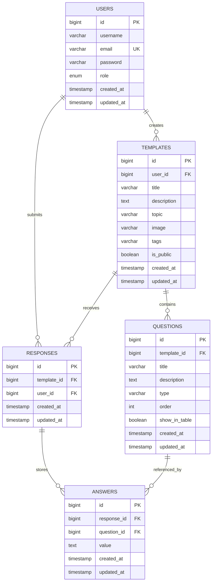

# Database Design

## 1. DBMS Choice

The transactional data model for Formics is designed for **MySQL 8+**.

Reasoning:

- the project is OLTP-oriented: users create templates, submit responses, and update profile data;
- the workload is transactional and relational;
- strong foreign-key support, constraints, roles, and SQL scripting fit the diploma requirements better than SQLite as the primary defended option.

SQLite remains available only for lightweight local development, while MySQL is the main defended database target.

## 2. Layering

This project uses a single transactional operational layer:

- **OLTP application layer**: normalized relational schema used by the backend API

Additional raw/staging/data mart layers are not required for the project goal because the system is not analytical.

## 3. Logical Schema

## 4. Data Dictionary

### `users`

- `id` – surrogate primary key
- `username` – display/login-facing username, required, minimum length 2
- `email` – unique e-mail, required
- `password` – bcrypt hash, never plain text
- `role` – `user` or `admin`
- quality expectations:
  - no duplicate emails
  - hashed password only
  - role restricted to allowed set

### `templates`

- `id` – primary key
- `user_id` – owner of the template
- `title` – required template title
- `description` – required business description
- `topic` – required business topic
- `image` – optional preview image URL/path
- `tags` – optional comma-separated tags
- `is_public` – visibility flag
- quality expectations:
  - every template has exactly one owner
  - public/private state is explicit

### `questions`

- `id` – primary key
- `template_id` – parent template
- `title` – required question label
- `description` – required text, may be empty string
- `type` – constrained question type
- `order` – display order inside template
- `show_in_table` – reporting/display flag
- quality expectations:
  - every question belongs to exactly one template
  - ordering must be deterministic within template

### `responses`

- `id` – primary key
- `template_id` – source template
- `user_id` – author of response
- quality expectations:
  - every response belongs to one template and one user
  - timestamps track creation/update

### `answers`

- `id` – primary key
- `response_id` – parent response
- `question_id` – referenced question
- `value` – normalized answer value stored as text
- quality expectations:
  - `(response_id, question_id)` must be unique
  - answer cannot exist without both response and question

## 5. Normalization

The schema is normalized to **3NF**:

- entities are separated by business meaning;
- repeating groups are extracted into child tables (`questions`, `answers`);
- non-key attributes depend on the whole key and only on the key;
- transitive dependencies are avoided.

## 6. Integrity and Transactions

Integrity is maintained through:

- primary keys on all tables;
- foreign keys between all parent-child entities;
- unique constraint on `users.email`;
- unique composite constraint on `answers(response_id, question_id)`;
- `NOT NULL`, `ENUM`, and `CHECK` constraints where applicable.

Transactions are used in backend business operations:

- template creation with nested questions;
- template update with question replacement;
- response creation with all nested answers.

This ensures partial writes do not leave inconsistent state.

## 7. Versioning

Database versioning is tracked in Git through versioned SQL scripts:

- [V1__schema.sql](/Users/danila/Projets/Formics/server/database/sql/V1__schema.sql)
- [V2__seed_demo_data.sql](/Users/danila/Projets/Formics/server/database/sql/V2__seed_demo_data.sql)
- [V3__roles.sql](/Users/danila/Projets/Formics/server/database/sql/V3__roles.sql)

## 8. DDL and Deployment

Schema creation is reproducible through SQL scripts, not manual actions.

Main script:

- [V1__schema.sql](/Users/danila/Projets/Formics/server/database/sql/V1__schema.sql)

Demo data:

- [V2__seed_demo_data.sql](/Users/danila/Projets/Formics/server/database/sql/V2__seed_demo_data.sql)

Roles and permissions:

- [V3__roles.sql](/Users/danila/Projets/Formics/server/database/sql/V3__roles.sql)

## 9. Access Rights

Defined DB roles:

- `app_read` – read-only access
- `app_write` – application runtime CRUD access
- `admin` – administrative schema-level access

The application should run under `app_write`, not under a superuser account.

## 10. Test Data

Demo records are available in:

- [seedLocalData.ts](/Users/danila/Projets/Formics/server/seedLocalData.ts) for local SQLite bootstrapping
- [V2__seed_demo_data.sql](/Users/danila/Projets/Formics/server/database/sql/V2__seed_demo_data.sql) for MySQL demonstration

The test data covers:

- admin user
- regular user
- public template
- multiple question types
- one submitted response with answers

## 11. Indexes

Indexes are defined for:

- ownership lookups (`templates.user_id`, `responses.user_id`)
- public/catalog browsing (`templates.is_public`, `templates.topic`)
- child collection traversal (`questions.template_id`, `answers.response_id`)
- response timelines (`responses.created_at`)

These indexes reflect the main application query patterns.
