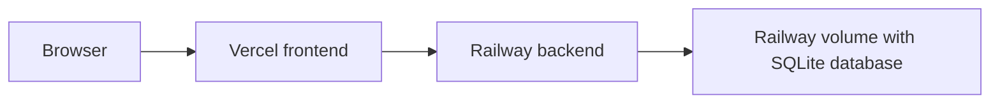

# Deployment Guide

This project is easiest to deploy in the following split configuration:

- frontend on Vercel
- backend on Railway
- persistence on Railway volume using SQLite

This path is recommended for a diploma demo because it minimizes setup complexity while keeping the application fully accessible to external users.

## Recommended Deployment Topology



## Why SQLite on Railway is the simplest option

- the backend already supports SQLite fallback;
- local demo users are seeded automatically in SQLite mode;
- no extra database service is required;
- fewer deployment points can fail during the defense.

Demo credentials in SQLite mode:

- `admin@local.test` / `password123`
- `demo@local.test` / `password123`

## 1. Deploy backend to Railway

Create a Railway service from the repository and point it to the `server` directory.

### Service source

- repository: this repo
- root directory: `server`
- Dockerfile: [server/Dockerfile](/Users/danila/Projets/Formics/server/Dockerfile)

### Railway variables for backend

Set the following variables:

```env
PORT=3000
JWT_SECRET=replace-with-a-strong-secret
DB_DIALECT=sqlite
SQLITE_STORAGE=/app/data/formics.sqlite
LOG_LEVEL=info
```

### Railway volume

Attach a persistent volume:

- mount path: `/app/data`

### Backend verification

After deploy, verify:

- `https://<your-backend-domain>/health`

Expected response:

```json
{ "status": "ok" }
```

## 2. Deploy frontend to Vercel

Create a Vercel project from the same repository, but use the `client` directory as the project root.

### Vercel project settings

- framework preset: `Vite`
- root directory: `client`
- build command: `npm run build`
- output directory: `dist`

### Vercel environment variable

Set:

```env
VITE_API_BASE_URL=https://<your-backend-domain>/api
```

The frontend already reads `VITE_API_BASE_URL` from [axiosInstance.ts](/Users/danila/Projets/Formics/client/src/axiosInstance.ts) and [useRealtimeAnalytics.ts](/Users/danila/Projets/Formics/client/src/hooks/useRealtimeAnalytics.ts).

### SPA routing

Vercel SPA fallback is configured in [client/vercel.json](/Users/danila/Projets/Formics/client/vercel.json).

## 3. Post-deploy manual test

### Public checks

- open frontend URL;
- check that the login page loads;
- check that the guest/public templates view loads.

### Auth checks

Log in with:

- `demo@local.test` / `password123`
- `admin@local.test` / `password123`

### Functional checks

Verify the following flow:

1. login
2. open templates
3. fill a public template
4. open responses
5. open profile
6. log in as admin
7. open admin panel
8. open live analytics

## 4. Troubleshooting

### Frontend opens, but API calls fail

Check:

- `VITE_API_BASE_URL` is set in Vercel;
- backend public domain is correct;
- Railway backend is healthy;
- backend logs do not show startup errors.

### Backend deploys, but login fails

Check:

- Railway variables use SQLite mode exactly as listed above;
- volume is mounted at `/app/data`;
- the first deploy created the SQLite file successfully.

### Vercel direct links return 404

Check that [client/vercel.json](/Users/danila/Projets/Formics/client/vercel.json) is included in the deployed root directory.
