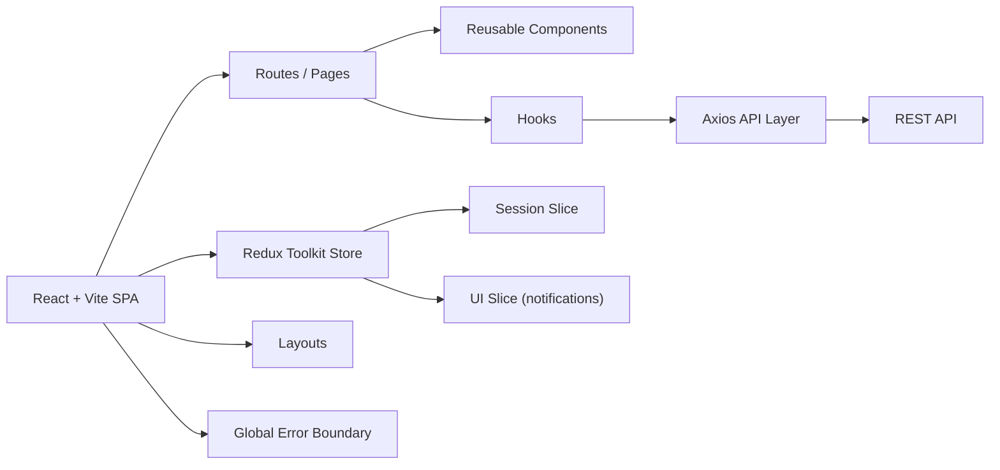
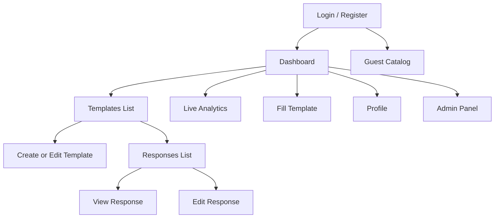

# Front-End Architecture

## 1. Architecture Diagram



## 2. Architecture Approach

- The application uses a component-based React architecture.
- Pages are responsible for route-level composition and user flows.
- Reusable UI blocks live in `client/src/components`.
- Request logic and page-oriented business logic live in `client/src/hooks`.
- Global cross-cutting concerns live in Redux Toolkit slices:
  - `sessionSlice` for auth/session state
  - `uiSlice` for notification state
- Global failures are handled by:
  - `ErrorBoundary` for render/runtime UI failures
  - Axios response interceptors for API failures and auth errors

## 3. Modules, Components, Routes, State

### Project structure

- `client/src/pages` route-level screens
- `client/src/components` reusable UI blocks
- `client/src/layouts` layout shell components
- `client/src/hooks` composables for API calls and page logic
- `client/src/store` Redux Toolkit store and slices
- `client/src/services` cross-cutting services such as Axios interceptors
- `client/src/styles` global styles and responsive rules

### Main routes

- `/login`
- `/register`
- `/guest`
- `/dashboard`
- `/analytics`
- `/templates`
- `/create-template`
- `/profile`
- `/admin`
- `/fill-template/:id`
- `/templates/:templateId/answers`
- `/templates/:templateId/answers/:answerId`

### State management

- Local state:
  - form values
  - filter values
  - page selection modes
  - loading/error state inside hooks
- Global state:
  - auth token and decoded user in `sessionSlice`
  - toast/snackbar notifications in `uiSlice`

## 4. User Flows / Navigation



## 5. API Documentation Used by Client

The client works with the backend documented in:

- [server/API.md](/Users/danila/Projets/Formics/server/API.md)

### Example request

`POST /api/auth/login`

```json
{
  "email": "demo@local.test",
  "password": "password123"
}
```

### Example response

```json
{
  "token": "jwt-token",
  "user": {
    "id": 2,
    "username": "Demo User",
    "email": "demo@local.test",
    "role": "user"
  }
}
```

### Main client-side data models

- `TemplateData`
- `TemplateDetail`
- `AnswerFull`
- `User`
- `ResponseInfo`

These are typed in the hooks layer and used by pages/components.

## 6. Tech Stack Justification

- React:
  - fits SPA requirements
  - mature ecosystem for routing, testing, and composition
- TypeScript:
  - gives typed API contracts and safer refactoring
- Vite:
  - fast development server and simple production build pipeline
- Redux Toolkit:
  - used for global state that is shared across the whole application
  - keeps auth/session and UI notifications centralized
- Axios:
  - centralized request handling and interceptors
- SCSS:
  - supports reusable styling architecture and responsive tokens
- Vitest + Testing Library:
  - covers unit and integration behaviour in a Vite-native setup

## 7. Error Handling

- UI runtime errors are caught by `ErrorBoundary`
- API errors are handled centrally via Axios interceptors
- Notifications are shown through a global notification center
- Protected routes redirect unauthorized users to `/login`

## 8. Responsive Strategy

- shared breakpoint styles in `client/src/styles`
- desktop + mobile layouts supported
- mobile navigation through burger menu
- panels, lists, and forms collapse to one-column layout on small screens
