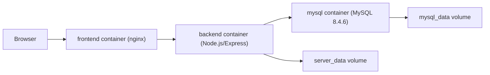

# Formics

Formics is a full-stack SPA for building form templates, collecting responses, administering users, and showing live operational analytics.

## Local Launch with Docker Compose

1. Create a local env file:

```bash
cp .env.example .env
```

2. Start all containers:

```bash
docker compose up --build
```

3. Open the application:

- Frontend: `http://localhost:5173`
- Backend health: `http://localhost:3000/health`
- MySQL: `localhost:3306`

4. Stop the stack:

```bash
docker compose down
```

To remove persistent database data as well:

```bash
docker compose down -v
```

## Container Architecture



## Images

### Frontend image

- Purpose: serve the React SPA and proxy `/api` requests to the backend.
- Dockerfile: [client/Dockerfile](/Users/danila/Projets/Formics/client/Dockerfile)
- Base images:
  - `node:20.19.0-alpine3.22` for build
  - `nginxinc/nginx-unprivileged:1.27.5-alpine3.21-perl` for runtime
- Main optimizations:
  - multi-stage build
  - final runtime image contains only built static assets and nginx config
  - non-root runtime image
  - `.dockerignore` excludes local artifacts
- Expected final size: typically well below `500MB`

### Backend image

- Purpose: run the Express API, Sequelize integration, authentication, and real-time analytics stream.
- Dockerfile: [server/Dockerfile](/Users/danila/Projets/Formics/server/Dockerfile)
- Base image: `node:20.19.0-alpine3.22`
- Main optimizations:
  - multi-stage build
  - production dependencies only in final image
  - non-root runtime user
  - dedicated healthcheck
  - `.dockerignore` excludes tests, logs, coverage, local env files
- Expected final size: typically well below `1GB`

### Database image

- Purpose: provide the transactional OLTP data store.
- Image: `mysql:8.4.6`
- Reason: official stable MySQL image, fits the project OLTP requirements.

## Containers

### `frontend`

- Role: static SPA delivery and API reverse proxy
- Ports:
  - external `${FRONTEND_PORT}`
  - internal `8080`
- Volumes: none
- Environment:
  - build arg `VITE_API_BASE_URL`
- Healthcheck:
  - `GET /health`

### `backend`

- Role: application API and SSE real-time analytics stream
- Ports:
  - external `${BACKEND_PORT}`
  - internal `3000`
- Volumes:
  - `server_data:/app/data` for persistent local runtime data if needed
- Environment:
  - `PORT`
  - `JWT_SECRET`
  - `DB_DIALECT`
  - `DB_URI`
  - `LOG_LEVEL`
- Healthcheck:
  - `GET /health`

### `mysql`

- Role: main relational database
- Ports:
  - external `${MYSQL_PORT}`
  - internal `3306`
- Volumes:
  - `mysql_data:/var/lib/mysql` for persistent database files
  - bind mount `./server/database/sql:/docker-entrypoint-initdb.d:ro` for schema/bootstrap scripts
- Environment:
  - `MYSQL_DATABASE`
  - `MYSQL_USER`
  - `MYSQL_PASSWORD`
  - `MYSQL_ROOT_PASSWORD`
- Healthcheck:
  - `mysqladmin ping`

## Environment Variables

### Root `.env`

- `FORMICS_VERSION`: image tag suffix used by compose
- `FRONTEND_PORT`: published frontend port
- `BACKEND_PORT`: published backend port
- `MYSQL_PORT`: published MySQL port
- `VITE_API_BASE_URL`: frontend API base path, `/api` for reverse-proxy setup
- `LOG_LEVEL`: backend structured log level
- `JWT_SECRET`: backend JWT signing secret
- `CORS_ORIGIN`: allowed frontend origin for browser access to backend API
- `MYSQL_DATABASE`: MySQL schema name
- `MYSQL_APP_USER`: application DB user
- `MYSQL_APP_PASSWORD`: application DB password
- `MYSQL_ROOT_PASSWORD`: MySQL root password

### Backend service env

- `PORT`: API listen port inside container
- `DB_DIALECT`: `mysql` in compose deployment
- `DB_URI`: Sequelize connection string

## Networks

- `edge`: public bridge network for the frontend entry point
- `app`: internal bridge network for private service-to-service communication

## Resource Requirements

Minimum recommended local resources:

- CPU: 2 cores
- RAM: 3 GB
- Disk: 3 GB free space for images, containers, and MySQL volume

## Build and Runtime Notes

- All application settings come from environment variables.
- Secrets are not stored in Dockerfiles or images.
- Logs are written to stdout/stderr in structured JSON format by the backend.
- The stack starts with a single command: `docker compose up`.
- SQL bootstrap files are versioned in Git under [server/database/sql](/Users/danila/Projets/Formics/server/database/sql).

## Metrics and Verification

This repository includes the full container configuration. Actual image size, build time, cold start time, and runtime resource usage depend on the local Docker host and should be measured on the target machine with:

```bash
docker images
docker compose up --build
docker stats
```

## Render Deployment

This repository includes a Render Blueprint:

- [render.yaml](/Users/danila/Projets/Formics/render.yaml)

Deployment layout:

- `frontend`: public Docker web service built from [client/Dockerfile](/Users/danila/Projets/Formics/client/Dockerfile)
- `backend`: public Docker web service built from [server/Dockerfile](/Users/danila/Projets/Formics/server/Dockerfile)
- `mysql`: private Docker service built from [deploy/mysql/Dockerfile](/Users/danila/Projets/Formics/deploy/mysql/Dockerfile)

Important naming assumption:

- the frontend nginx config proxies API requests to `http://backend:3000/api/`;
- the backend connects to MySQL via `mysql:3306`;
- so in Render the service names should remain exactly `frontend`, `backend`, and `mysql`.

Render setup steps:

1. Push this repository to GitHub.
2. In Render, choose `New -> Blueprint`.
3. Connect the repository that contains [render.yaml](/Users/danila/Projets/Formics/render.yaml).
4. Confirm creation of all services.
5. Wait until `mysql`, `backend`, and `frontend` finish their first deploy.
6. Open the public URL of `frontend`.

What to verify after deploy:

- frontend opens at the Render URL;
- backend responds at `/health`;
- login works;
- public templates load;
- form submission works;
- admin panel works for admin user;
- live analytics opens and updates.
