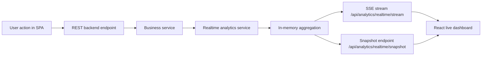

# Real-Time Analytics

## Real-Time Scope

The project treats the following application events as real-time:

- template creation
- template update
- response submission

Target delay: up to 5 seconds.

Reasoning:

- the stream is delivered over Server-Sent Events (SSE), so updates normally arrive in under 1 second on a local or standard web deployment;
- a 5-second limit is conservative and acceptable for an operational dashboard where the main goal is near real-time activity visibility, not financial trading precision.

## Event Path



## Source and Trigger

- `POST /api/templates`
  - trigger: user creates a template
  - event type: `template_created`
- `PUT /api/templates/:id`
  - trigger: user updates a template
  - event type: `template_updated`
- `POST /api/responses/from-template/:templateId`
  - trigger: user submits a filled form
  - event type: `response_submitted`

## Event Format

```json
{
  "type": "response_submitted",
  "userId": 12,
  "templateId": 7,
  "templateTitle": "Local Feedback Form",
  "answersCount": 5,
  "occurredAt": "2026-03-30T20:00:00.000Z"
}
```

## Processing Logic

The processing module is isolated in [realtimeAnalyticsService.ts](/Users/danila/Projets/Formics/server/services/realtimeAnalyticsService.ts).

It is responsible for:

- receiving events from backend business services;
- pruning old events outside the analytics window;
- counting response and template activity;
- calculating active users in the last 5 minutes;
- building minute-level aggregates for the dashboard;
- preparing the current snapshot for API and SSE consumers.

## Serving Layer

Backend endpoints:

- snapshot: [analytics.ts](/Users/danila/Projets/Formics/server/routes/analytics.ts)
  - `GET /api/analytics/realtime/snapshot`
- stream: [analytics.ts](/Users/danila/Projets/Formics/server/routes/analytics.ts)
  - `GET /api/analytics/realtime/stream?token=<jwt>`

Frontend consumer:

- hook: [useRealtimeAnalytics.ts](/Users/danila/Projets/Formics/client/src/hooks/useRealtimeAnalytics.ts)
- page: [RealtimeAnalyticsPage.tsx](/Users/danila/Projets/Formics/client/src/pages/RealtimeAnalyticsPage/RealtimeAnalyticsPage.tsx)

## Connection Loss Handling

If the SSE connection is interrupted:

- the browser keeps retrying automatically through `EventSource`;
- the UI shows a visible disconnected state;
- the last received snapshot remains visible, but it is marked as potentially stale.

## Data Safety

The stream does not expose raw answer values or personal text entered into forms.

Only operational metadata is sent:

- event type;
- internal user id;
- template id/title;
- number of submitted answers;
- timestamps;
- aggregated counters.
