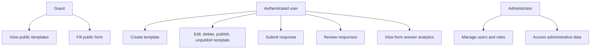

<!-- prev: scope.md | next: ../02-technical/index.md -->

# Features and Requirements

## Epics Overview

| Epic | Description | Stories | Status |
|------|-------------|---------|--------|
| E1: User and Access Management | Authentication, roles, route protection, admin panel. | 4 | Implemented |
| E2: Dynamic Form Builder | Template creation, editing, deletion, public/private access, question types. | 6 | Implemented |
| E3: Response Collection | Public and authenticated submissions, response review, editing and deletion. | 4 | Implemented |
| E4: Analytics | Form response analytics and real-time activity analytics. | 3 | Implemented |
| E5: Deployment and Quality | Cloud deployment, Docker, tests, security, documentation. | 4 | Implemented |

## User Stories

| ID | User Story | Acceptance Criteria | Priority | Status |
|----|------------|---------------------|----------|--------|
| US-001 | As a user, I want to register and log in so that I can manage my forms. | JWT token is issued; password is hashed; validation is applied. | Must | Implemented |
| US-002 | As a user, I want to create a form template so that I can collect structured answers. | Template metadata and questions are saved in database. | Must | Implemented |
| US-003 | As a user, I want to add answer options so that respondents choose from predefined values. | Single-choice and multiple-choice question types are supported. | Must | Implemented |
| US-004 | As a user, I want to define correct answers so that responses can be checked automatically. | Correct and incorrect answers are calculated in analytics. | Should | Implemented |
| US-005 | As a form owner, I want to edit and delete forms so that I can maintain my templates. | Edit and delete actions are available in the template list. | Must | Implemented |
| US-006 | As a form owner, I want to disable public access so that a form can become private again. | Public/private toggle updates template access. | Must | Implemented |
| US-007 | As a guest, I want to fill public forms without login so that I can submit answers quickly. | Public endpoint accepts responses only for public templates. | Must | Implemented |
| US-008 | As an owner, I want response analytics so that I can understand form results. | Total responses, answer counts, option counts, and accuracy are displayed. | Should | Implemented |
| US-009 | As an admin, I want to manage users so that system access is controlled. | Admin can list users and update roles. | Should | Implemented |

## Use Case Diagram

## Non-Functional Requirements

| Category | Requirement | Implementation |
|----------|-------------|----------------|
| Security | Passwords must not be stored in plain text. | Passwords are hashed with bcrypt. |
| Security | Private templates must not be accessible to guests. | Public endpoints filter by `isPublic`; protected endpoints use JWT. |
| Performance | Common CRUD operations should be responsive for demo-scale data. | Sequelize queries with indexes on key foreign keys. |
| Reliability | Application should survive deployment restarts. | Railway managed MySQL persists data; backend has health endpoint. |
| Usability | Interface should support desktop and mobile. | React SPA uses responsive SCSS. |
| Maintainability | Code should be modular. | Backend services/routes/models and frontend pages/hooks/components are separated. |
