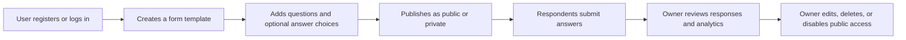

<!-- prev: ../index.md | next: problem-and-goals.md -->

# 1. Project Overview

This section describes the business context of Formics: the problem, target users, project scope, and functional requirements.

## Executive Summary

Many small organizations and educational teams collect information through a mixture of spreadsheets, messengers, ad hoc forms, and manual checks. This creates weak access control, duplicated data, unclear ownership, and limited response analysis. Formics solves this by providing a centralized platform where users can create dynamic form templates, publish them privately or publicly, collect responses, review submissions, automatically check correct answers, and monitor system activity. The project delivers a working full-stack application rather than only a prototype: it includes a React SPA, Express API, MySQL database, role-based access control, cloud deployment, Docker-based local deployment, and tests.

## Key Highlights

| Aspect | Description |
|--------|-------------|
| Problem | Form creation and response management are often fragmented and difficult to control. |
| Solution | A web platform for dynamic form lifecycle management: templates, questions, responses, access, and analytics. |
| Target users | Form authors, respondents, administrators, and diploma reviewers. |
| Key features | Authentication, form builder, public/private access, response review, scoring, analytics, admin panel. |
| Tech stack | React, TypeScript, Vite, Express, Sequelize, MySQL, Docker, Railway, Vercel. |

## Product Boundaries

Formics focuses on operational form management. It is not intended to replace large enterprise survey suites or learning management systems. The project goal is to demonstrate a coherent, deployable product with real data storage, real API interaction, and enough business value to justify the chosen architecture.

## Main User Journey

