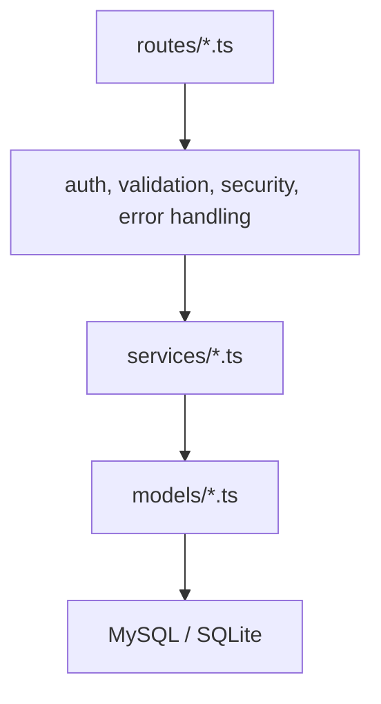

<!-- prev: ../tech-stack.md | next: frontend.md -->

# Criterion: Backend Architecture and Development

## Architecture Decision Record

**Status:** Accepted  
**Date:** May 2026

### Context

Formics needs a backend that can authenticate users, enforce access rules, manage templates, store responses, calculate analytics, and expose a stable API to the React frontend. The backend must be more than a static JSON provider: it must work with a real database, apply validation, handle errors, and support production deployment.

### Decision

The backend is implemented as a Node.js and Express application written in TypeScript. It uses layered architecture: routes for HTTP endpoints, middleware for cross-cutting concerns, services for business logic, Sequelize models for data access, and centralized utilities for logging, JWT, and serialization.

### Alternatives Considered

| Alternative | Pros | Cons | Why Not Chosen |
|-------------|------|------|----------------|
| NestJS | Strong structure, decorators, dependency injection. | More framework overhead for this project size. | Express was sufficient and simpler. |
| Django | Batteries included, admin panel. | Different language stack and heavier backend structure. | Project already uses TypeScript across frontend/backend. |
| Plain Node.js HTTP | Minimal dependencies. | Would require custom routing, validation, error handling. | Does not match modern framework expectation. |

## Implementation Details

Key files:

- `server/app.ts` creates the Express application and registers middleware/routes.
- `server/routes` contains API endpoint definitions.
- `server/services` contains business logic.
- `server/models` contains Sequelize models.
- `server/middleware` contains authentication, authorization, security, validation, and error handling.

## Key Decisions

| Decision | Rationale |
|----------|-----------|
| JWT authentication | Fits SPA architecture and stateless API requests. |
| bcrypt passwords | Standard secure password hashing. |
| Service layer | Keeps route handlers small and testable. |
| Central error middleware | Makes API errors consistent. |
| Pino logging | Structured logs are suitable for Railway and Docker output. |

## Requirements Checklist

| Requirement | Status | Evidence |
|-------------|--------|----------|
| Modern framework | Implemented | Express application in `server/app.ts`. |
| Layered architecture | Implemented | Routes, services, models, middleware. |
| ORM | Implemented | Sequelize models. |
| Global error handling | Implemented | Error middleware returns structured errors. |
| Logging | Implemented | Pino logger and request/error logs. |
| Authentication/authorization | Implemented | JWT middleware and role/owner checks. |
| JSON API | Implemented | REST endpoints consume and return JSON. |
| Production deployment | Implemented | Railway backend service. |

## Known Limitations

The backend is a single service, not a microservice system. That is acceptable for the project scope because Formics is a compact form management platform. Future production growth could split analytics, notifications, and file storage into separate services.
