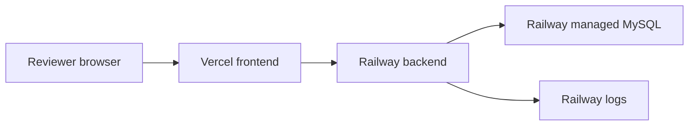

<!-- prev: realtime-analytics.md | next: containerization.md -->

# Criterion: Cloud Deployment

## Architecture Decision Record

**Status:** Accepted  
**Date:** May 2026

### Context

The application must be reachable by reviewers through public URLs and use at least one managed cloud service. Secrets should not be committed to the repository, and deployment should be reproducible from Git.

### Decision

The frontend is deployed to Vercel. The backend is deployed to Railway. The production database is Railway managed MySQL. Configuration is stored in environment variables in Vercel and Railway.

### Alternatives Considered

| Alternative | Pros | Cons | Why Not Chosen |
|-------------|------|------|----------------|
| Single VPS | Full control. | More manual operations and security work. | Managed platforms are safer for diploma demo. |
| Render full-stack | Simple service setup. | Railway MySQL setup was already working. | Existing Railway/Vercel split is stable. |
| Local-only deployment | Easy to control. | Not externally reachable. | Does not meet cloud requirement. |

## Cloud Architecture

## Resources

| Resource | Provider | Purpose |
|----------|----------|---------|
| Frontend project | Vercel | Hosts built React SPA. |
| Backend service | Railway | Runs Express API. |
| Managed MySQL | Railway | Stores production data. |
| Environment variables | Vercel/Railway | Stores API URLs, DB URI, JWT secret, CORS origin. |

## Requirements Checklist

| Requirement | Status | Evidence |
|-------------|--------|----------|
| Public deployment | Implemented | Vercel and Railway URLs. |
| Managed cloud service | Implemented | Railway managed MySQL. |
| Secure secrets | Implemented | Environment variables, not committed secrets. |
| Git history | Implemented | GitHub repository. |
| Cloud documentation | Implemented | This thesis section and README deployment notes. |
| Network configuration | Implemented | Public frontend/backend, controlled CORS. |
| Cost control | Implemented | Only required free/trial resources are used. |

## Known Limitations

The deployment does not include Infrastructure as Code such as Terraform, nor advanced monitoring such as Prometheus/Grafana. These would be appropriate for a larger production environment.
