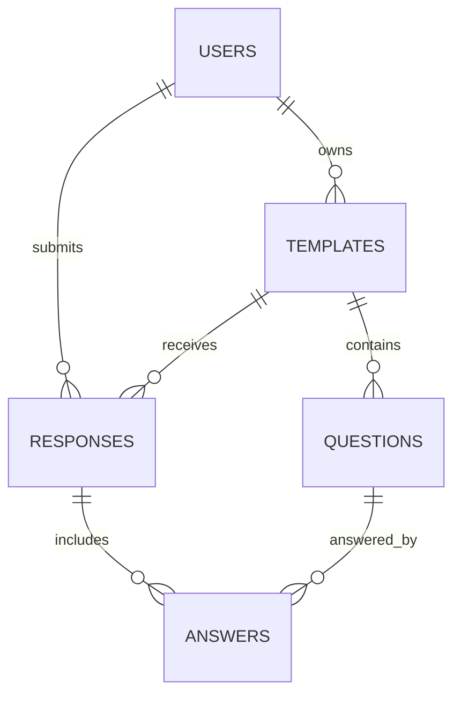

<!-- prev: frontend.md | next: realtime-analytics.md -->

# Criterion: Relational Database, OLTP

## Architecture Decision Record

**Status:** Accepted  
**Date:** May 2026

### Context

Formics stores strongly related transactional data: users, templates, questions, responses, and answers. The application must preserve ownership, prevent orphan records, support response analytics, and avoid storing all data as unstructured JSON.

### Decision

The production database is MySQL, accessed through Sequelize ORM. The schema is normalized into separate tables with primary keys, foreign keys, indexes, constraints, and versioned SQL scripts. SQLite is used only for local development and automated tests.

### Alternatives Considered

| Alternative | Pros | Cons | Why Not Chosen |
|-------------|------|------|----------------|
| MongoDB | Flexible documents for forms. | We need strong relational integrity. | Relational model fits better. |
| PostgreSQL | Strong relational database. | MySQL was easier to run through Railway setup used in the project. | MySQL satisfies OLTP needs. |
| SQLite only | Simple and file-based. | Not appropriate as main production database. | Used only locally and in tests. |

## Logical Schema

## Tables

| Table | Purpose |
|-------|---------|
| `users` | Accounts, emails, hashed passwords, roles. |
| `templates` | Form metadata and public/private status. |
| `questions` | Dynamic fields, answer options, correct answers. |
| `responses` | Submitted form instances. |
| `answers` | Individual answer values for each response/question. |

## Integrity and Transactions

Foreign keys enforce relationships between users, templates, questions, responses, and answers. Cascading deletes remove dependent records when a parent template or response is deleted. Template creation and response submission are wrapped in Sequelize transactions so partially saved data does not remain after an error.

## Requirements Checklist

| Requirement | Status | Evidence |
|-------------|--------|----------|
| Modern relational DBMS | Implemented | Railway managed MySQL. |
| 3NF-style structure | Implemented | Separate tables for entities and relationships. |
| Primary/foreign keys | Implemented | SQL scripts and Sequelize models. |
| Constraints and indexes | Implemented | DDL scripts in `server/database/sql`. |
| DDL scripts in Git | Implemented | `V1__schema.sql`, `V4__question_options_and_scoring.sql`. |
| Test data | Implemented | `V2__seed_demo_data.sql`, `railway_seed.sql`, `seedLocalData.ts`. |
| Password protection | Implemented | bcrypt hashes in user records. |
| Application not dependent on CSV/Excel | Implemented | Real DBMS is used. |

## Known Limitations

The project uses versioned SQL scripts, but it does not include a full migration runner with a migration history table. For production, a tool such as Flyway, Liquibase, Umzug, or Sequelize CLI could make schema changes more controlled.
