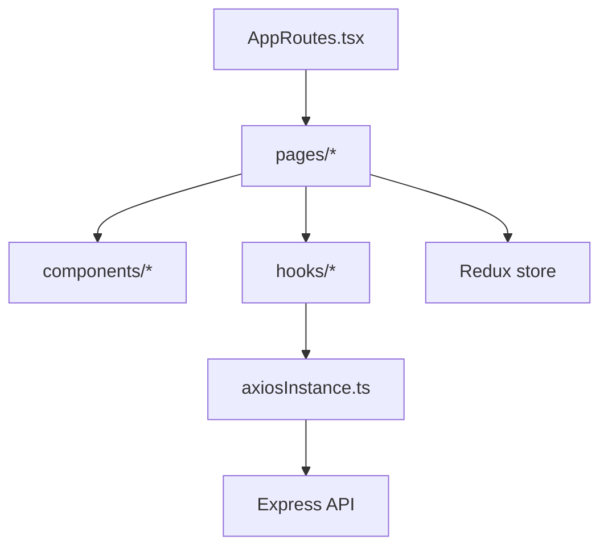

<!-- prev: backend.md | next: database.md -->

# Criterion: Front-End Architecture and Development

## Architecture Decision Record

**Status:** Accepted  
**Date:** May 2026

### Context

The application needs a browser interface for registration, login, form creation, public form completion, response management, answer analytics, and administration. A static set of pages would not meet the requirement because the product needs routing, state management, API integration, reusable components, validation, loading states, and error handling.

### Decision

The frontend is implemented as a React SPA with TypeScript and Vite. It uses React Router for navigation, Redux Toolkit for global session/UI state, Axios for centralized API access, custom SCSS components, and hooks for page-level logic.

### Alternatives Considered

| Alternative | Pros | Cons | Why Not Chosen |
|-------------|------|------|----------------|
| Angular | Strong structure and built-in patterns. | More verbose and less aligned with existing code. | React was faster for this project. |
| Vue | Simple syntax and good SPA support. | Less consistency with existing React code. | React ecosystem was preferred. |
| Static HTML | Simple to host. | No real SPA architecture, state, or reusable components. | Does not meet requirements. |

## Architecture

## Implemented Features

- Client-side routes for login, register, guest mode, dashboard, templates, form filling, profile, admin, analytics, and response pages.
- Protected routes for authenticated areas.
- Controlled forms for authentication, profile editing, template creation, response editing, and form completion.
- Dynamic question rendering for text, multiline, number, checkbox, single choice, and multiple choice fields.
- Password visibility toggle on login and registration.
- Loading skeletons and user-facing error messages.
- Responsive layout for desktop and mobile.

## Requirements Checklist

| Requirement | Status | Evidence |
|-------------|--------|----------|
| Modern SPA framework | Implemented | React SPA built with Vite. |
| Routing | Implemented | React Router routes in `AppRoutes.tsx`. |
| Components/pages/hooks separation | Implemented | `components`, `pages`, `hooks`, `store`, `layouts`. |
| Global state | Implemented | Redux Toolkit session and UI slices. |
| API interaction | Implemented | Axios instance and interceptors. |
| Error handling | Implemented | ErrorBoundary, InlineAlert, NotificationCenter, interceptors. |
| Forms and validation | Implemented | Controlled forms and basic frontend validation. |
| Testing | Implemented | Component and integration tests. |

## Known Limitations

The frontend does not currently include advanced performance evidence such as Lighthouse reports or formal WCAG audit results. The UI is responsive and functional, but accessibility can be improved with deeper keyboard and screen-reader testing.
