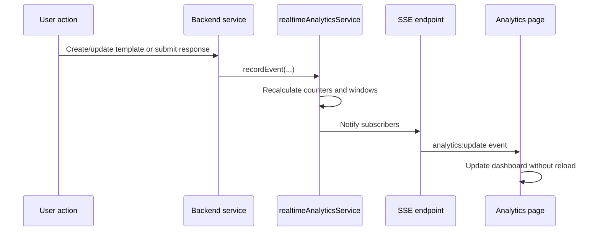

<!-- prev: database.md | next: cloud.md -->

# Criterion: Real-Time Analytics

## Architecture Decision Record

**Status:** Accepted  
**Date:** May 2026

### Context

The platform should show current activity without requiring users to refresh the page manually. The activity should come from real application events, not random simulated data or static files.

### Decision

Real-time analytics is implemented with backend event recording and Server-Sent Events. Business services record events when templates are created, templates are updated, or responses are submitted. A dedicated analytics service aggregates events and publishes snapshots to connected clients.

### Alternatives Considered

| Alternative | Pros | Cons | Why Not Chosen |
|-------------|------|------|----------------|
| Polling every few seconds | Simple. | Not a continuous stream and less efficient. | SSE better matches requirement. |
| WebSocket | Full duplex communication. | More complexity than needed. | Analytics only needs server-to-client updates. |
| Message broker | Scalable and durable. | Too large for MVP. | Future improvement. |

## Event Flow

## Real-Time Data

Real-time data includes `template_created`, `template_updated`, and `response_submitted` events. Target delay is up to 1-5 seconds, which is sufficient for an operational dashboard. The stream does not expose raw response text to public users.

## Requirements Checklist

| Requirement | Status | Evidence |
|-------------|--------|----------|
| Real event type | Implemented | Events come from template and response services. |
| Backend stream channel | Implemented | SSE endpoint under `/api/analytics/realtime/stream`. |
| Processing as events arrive | Implemented | Dedicated `realtimeAnalyticsService`. |
| Current state API | Implemented | Snapshot endpoint. |
| Frontend dynamic visualization | Implemented | `RealtimeAnalyticsPage` updates without reload. |
| Lost connection feedback | Implemented | Hook tracks connection state and errors. |

## Known Limitations

The event store is in memory. This is acceptable for the diploma MVP but means metrics reset after backend restart. A production version should move stream state to Redis, a message broker, or a time-series store.
