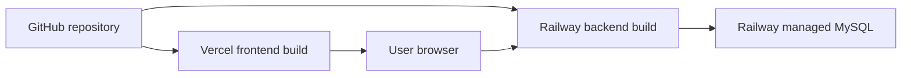

<!-- prev: criteria/testing-api-quality.md | next: ../03-user-guide/index.md -->

# Deployment

## Production Deployment

| Component | Platform | URL / Access |
|-----------|----------|--------------|
| Frontend | Vercel | https://formiks-drab.vercel.app/ |
| Backend | Railway | https://backend-production-ccc3.up.railway.app |
| Database | Railway managed MySQL | Private connection from backend, public proxy for administration. |

## Deployment Architecture



## Backend Environment Variables

| Variable | Purpose |
|----------|---------|
| `PORT` | HTTP port, normally `3000`. |
| `JWT_SECRET` | Secret for signing JWT tokens. |
| `DB_DIALECT` | `mysql` in production, `sqlite` locally if needed. |
| `DB_URI` | Railway MySQL connection URL. |
| `CORS_ORIGIN` | Allowed frontend origins. |
| `LOG_LEVEL` | Runtime log level. |

## Frontend Environment Variables

| Variable | Purpose |
|----------|---------|
| `VITE_API_BASE_URL` | Public API base URL, for example `https://backend-production-ccc3.up.railway.app/api`. |

## Database Setup

The production MySQL schema is created with SQL scripts stored in Git. The initial setup uses `railway_schema.sql` and `railway_seed.sql`. Later schema changes are stored as versioned SQL files, for example `railway_v4_question_options_and_scoring.sql`, which adds answer options and correct answer fields.

## Local Docker Startup

```bash
cp .env.example .env
docker compose up --build
```

The local stack starts:

- frontend container on the configured frontend port;
- backend container on the configured API port;
- MySQL container with persistent `mysql_data` volume.

## Manual Local Development

Backend:

```bash
cd server
npm install
npm run dev
```

Frontend:

```bash
cd client
npm install
npm run dev
```

## Verification Commands

```bash
cd server
npm run typecheck
npm test
npm run build

cd ../client
npm run build
npm run lint
```

## Deployment Risks

| Risk | Mitigation |
|------|------------|
| Database schema not updated | Run the latest Railway SQL migration before using new features. |
| CORS blocks frontend | Set `CORS_ORIGIN` to include the Vercel domain. |
| Secrets exposed | Store production secrets in Railway/Vercel variables only. |
| Cloud service unavailable | Keep local Docker setup as fallback for demonstration. |
