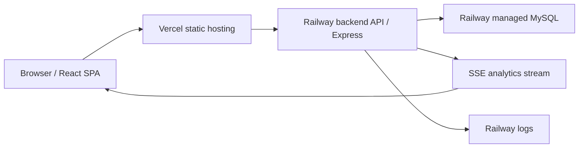
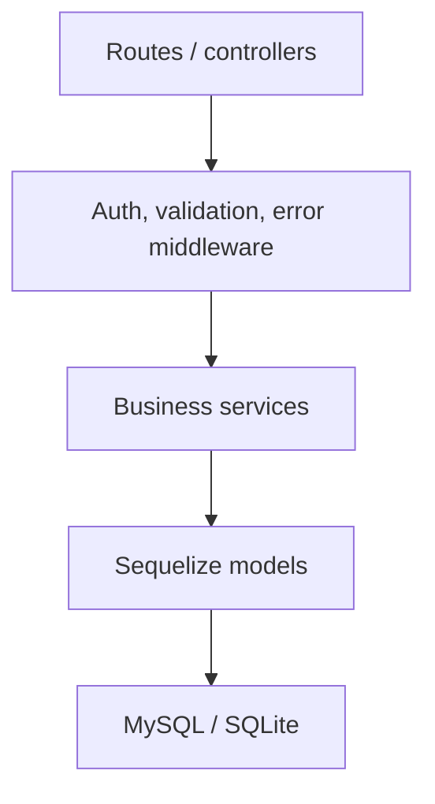
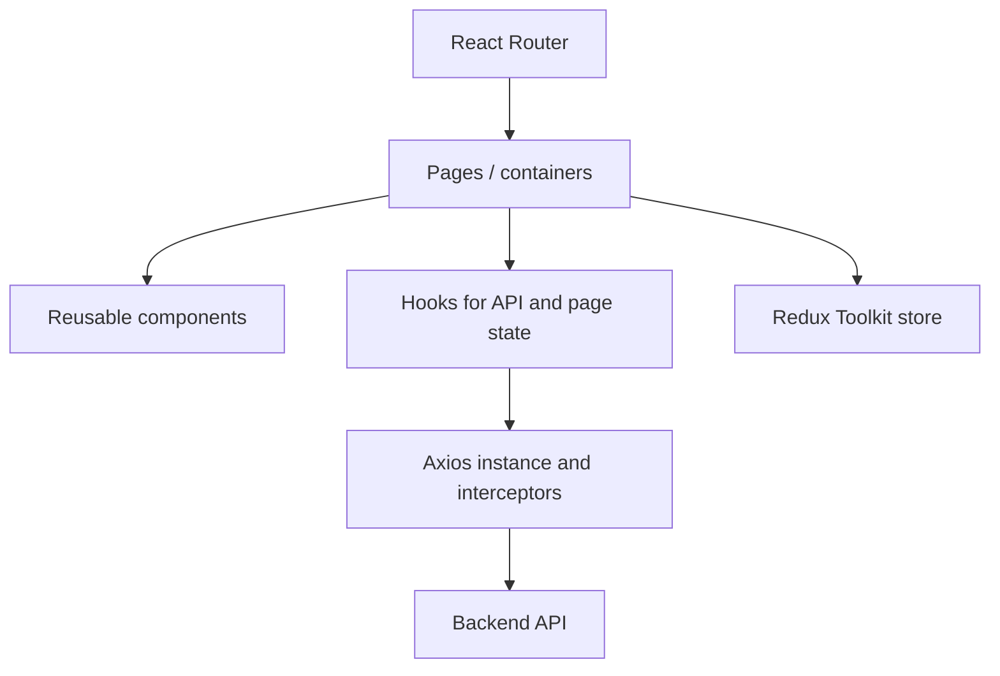
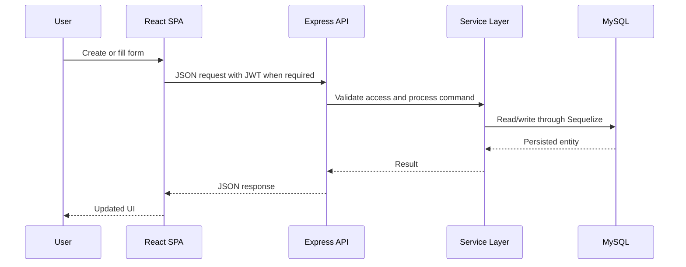

<!-- prev: ../01-project-overview/features.md | next: tech-stack.md -->

# 2. Technical Implementation

This section describes the architecture, technology choices, selected evaluation criteria, and deployment model.

## Solution Architecture

## System Components

| Component | Responsibility | Technology |
|-----------|----------------|------------|
| Frontend | SPA UI, routing, forms, dashboards, API calls. | React, TypeScript, Vite, Redux Toolkit, Axios, SCSS. |
| Backend | REST API, business logic, authentication, authorization, validation, analytics. | Node.js, Express, TypeScript. |
| Database | Persistent OLTP storage for users, templates, questions, responses, and answers. | MySQL, Sequelize ORM. |
| Real-time channel | Near real-time delivery of activity analytics to the UI. | Server-Sent Events. |
| Deployment | Public hosting and managed database. | Vercel, Railway, Docker. |

## Backend Layering

The backend follows a layered structure: routes receive HTTP requests, middleware applies cross-cutting checks, services implement business logic, and Sequelize models handle database access.

## Frontend Layering

The frontend is organized as a component-based SPA with route-level pages, reusable UI components, hooks, global store slices, and centralized API handling.

## Data Flow

## Key Technical Decisions

| Decision | Rationale | Alternatives Considered |
|----------|-----------|-------------------------|
| React SPA with Vite | Fast development, component model, good fit for form-heavy UI. | Angular, Vue. |
| Express API | Lightweight, familiar Node.js framework suitable for REST services. | NestJS, Fastify. |
| MySQL with Sequelize | Relational model fits users, templates, questions, responses, and answers. | MongoDB, PostgreSQL, Prisma. |
| SSE for live analytics | One-way server-to-client updates are enough for dashboard metrics. | WebSocket, polling. |
| Railway + Vercel | Simple public cloud deployment for backend/database and frontend. | Render-only deployment, VPS. |

## Security Overview

| Aspect | Implementation |
|--------|----------------|
| Authentication | JWT tokens issued by backend after login. |
| Authorization | Role checks and owner checks in middleware/services. |
| Password storage | bcrypt hashes, no plain text passwords. |
| Input validation | express-validator on backend; controlled forms on frontend. |
| CORS | Restricted through `CORS_ORIGIN`. |
| Rate limiting | API and auth rate limits configured in backend middleware. |
| Secrets | Production secrets stored in Railway and Vercel environment variables. |
