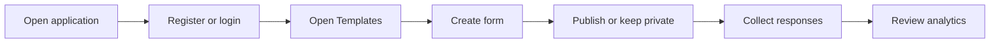

<!-- prev: ../02-technical/deployment.md | next: features.md -->

# 3. User Guide

This section explains how to use Formics from the perspective of a user, guest respondent, and administrator.

## System Requirements

| Requirement | Minimum | Recommended |
|-------------|---------|-------------|
| Browser | Chrome, Firefox, Safari, or Edge with modern JavaScript support. | Latest stable version. |
| Screen | Mobile or desktop browser. | Desktop for administration and analytics. |
| Internet | Required for cloud deployment. | Stable connection for live analytics. |

## Accessing the Application

1. Open https://formiks-drab.vercel.app/.
2. Register a new account or use the available demo account if provided during the defense.
3. Use the navigation header to open templates, analytics, profile, or admin pages.

## Quick Start

| Task | How To |
|------|--------|
| Create a form | Log in, open Templates, choose create template, add metadata and questions. |
| Add answer options | Select single-choice or multiple-choice question type and enter options. |
| Publish a form | Enable public access on the template or use Make public in the template list. |
| Disable public access | Use Make private in the template list. |
| Fill a public form | Open Guest mode, choose a public template, submit answers. |
| Review responses | Open a template from Templates and inspect submitted responses. |
| View analytics | Open a template responses page or the live analytics dashboard. |

## User Roles

| Role | Permissions |
|------|-------------|
| Guest | View and submit public forms only. |
| User | Create templates, manage owned forms, submit responses, review own template responses. |
| Admin | Manage users and access broader administrative functions. |

## First Launch Flow

