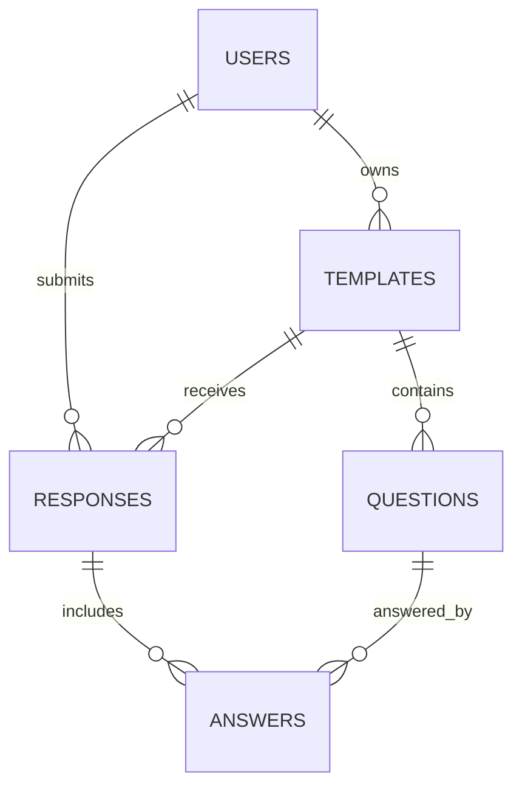

<!-- prev: api-reference.md | next: none -->

# Database Schema

## Overview

| Field | Value |
|-------|-------|
| Database | MySQL in production, SQLite for local/test mode |
| ORM | Sequelize |
| Main workload | OLTP |
| Schema scripts | `server/database/sql` |

## ER Diagram

## Data Dictionary

### `users`

| Column | Type | Notes |
|--------|------|-------|
| `id` | BIGINT UNSIGNED | Primary key. |
| `username` | VARCHAR(100) | Required display name. |
| `email` | VARCHAR(255) | Unique login email. |
| `password` | VARCHAR(255) | bcrypt hash. |
| `role` | ENUM | `user` or `admin`. |
| `created_at`, `updated_at` | TIMESTAMP | Audit timestamps. |

### `templates`

| Column | Type | Notes |
|--------|------|-------|
| `id` | BIGINT UNSIGNED | Primary key. |
| `user_id` | BIGINT UNSIGNED | Owner foreign key. |
| `title` | VARCHAR(150) | Template name. |
| `description` | TEXT | Template description. |
| `topic` | VARCHAR(100) | Classification field. |
| `tags` | VARCHAR(255) | Optional tags. |
| `is_public` | BOOLEAN | Controls guest access. |

### `questions`

| Column | Type | Notes |
|--------|------|-------|
| `id` | BIGINT UNSIGNED | Primary key. |
| `template_id` | BIGINT UNSIGNED | Parent template. |
| `title` | VARCHAR(150) | Question text. |
| `description` | TEXT | Optional/help text. |
| `type` | VARCHAR(50) | Field type. |
| `options` | JSON | Optional answer choices. |
| `correct_answer` | TEXT | Optional value for automatic checking. |
| `order` | INT UNSIGNED | Display order. |
| `show_in_table` | BOOLEAN | Display flag. |

### `responses`

| Column | Type | Notes |
|--------|------|-------|
| `id` | BIGINT UNSIGNED | Primary key. |
| `template_id` | BIGINT UNSIGNED | Submitted template. |
| `user_id` | BIGINT UNSIGNED | Submitter or technical guest user. |
| `created_at`, `updated_at` | TIMESTAMP | Submission timestamps. |

### `answers`

| Column | Type | Notes |
|--------|------|-------|
| `id` | BIGINT UNSIGNED | Primary key. |
| `response_id` | BIGINT UNSIGNED | Parent response. |
| `question_id` | BIGINT UNSIGNED | Answered question. |
| `value` | TEXT | Stored answer value. Multiple choices are stored as JSON string values. |

## Version History

| Version | Script | Purpose |
|---------|--------|---------|
| V1 | `V1__schema.sql` | Initial schema. |
| V2 | `V2__seed_demo_data.sql` | Demo users and sample form. |
| V3 | `V3__roles.sql` | Database roles and permissions. |
| V4 | `V4__question_options_and_scoring.sql` | Options and correct answer fields. |
